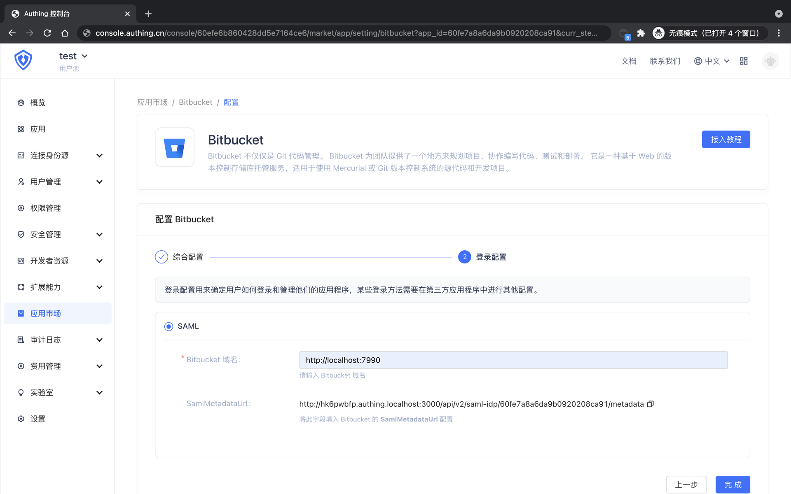

<IntegrationDetailCard :title="`在 ${$localeConfig.brandName} 中创建应用`">

进入[**控制台**](https://console.authing.cn) > **单点登录 SSO** > **添加应用** ，找到 **Bitbucket** ，点击进入详情，然后点击获取应用。

输入应用名称，点击下一步。

输入你的 **Bitbucket 域名**，一般格式为 **http://&lt;SERVER_HOSTNAME&gt;:&lt;PORT&gt;**。

点击完成，在访问授权页点击「允许所有用户访问」。

</IntegrationDetailCard>
