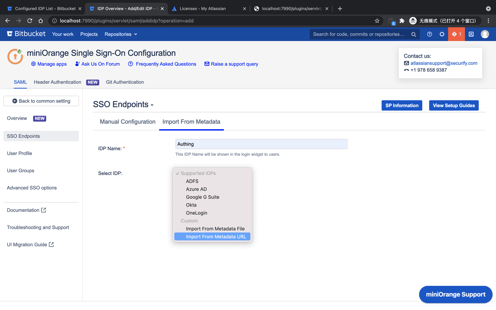

<IntegrationDetailCard title="配置 Bitbucket SSO 登录">

配置 bitbucket SAML SSO 登录，你需要有管理员权限。移动到顶部导航 `设置`，点击 **设置**。

在侧边栏找到 **Find new apps**。

搜索 `miniorange`， 找到 **mO Bitbucket SAML SSO/Bitbucket SSO/Bitbucket Single Sign On**， 点击 **Free trial**。

点击插件管理 **Manage**。

点击 **Configure**。

选择 **Manual Setup**。

选择 **Import From Metadata**， 填写你的 **IDP Name**， 选择 **Import From Metadata URL**， 该 URL 来自 {{$localeConfig.brandName}} 对应的应用，你可以 **复制** 该值，**完成** 填写。

{{$localeConfig.brandName}} 对应的应用中 **SamlMetadataUrl** 配置选项如图。

点击 **Import**， 完成元数据信息获取。

点击下方 **Save**， 之后点击 **Test Configuration**。

进入 {{$localeConfig.brandName}} 登录页， 输入对应的 **账号密码** 完成登录。

测试成功。

</IntegrationDetailCard>
