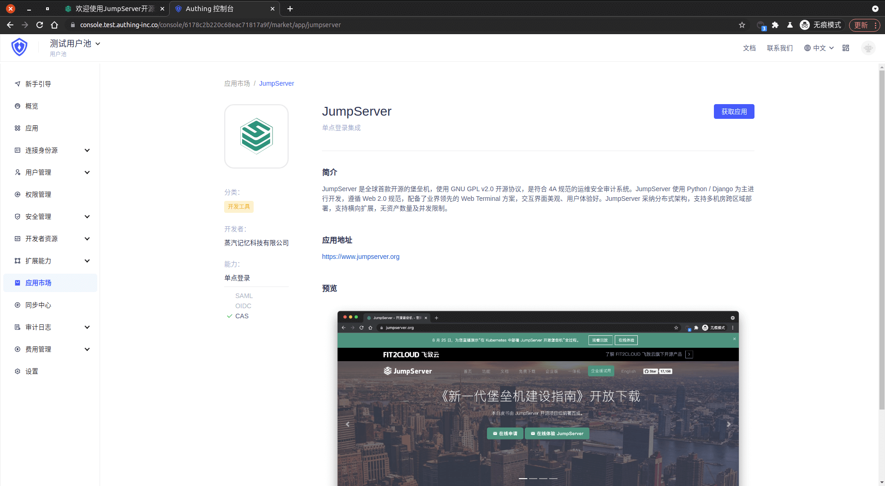
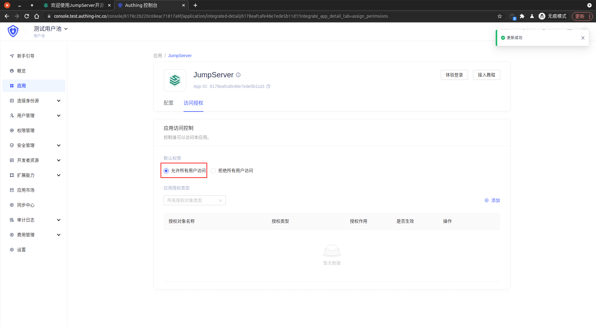

<IntegrationDetailCard :title="`在 ${$localeConfig.brandName} 中创建应用`">

进入[**控制台**](https://console.authing.cn) > **单点登录 SSO** > **添加应用** ，找到 **JumpServer** ，点击进入详情，然后点击获取应用。

输入应用名称，点击下一步。

输入你的 **JumpServer 登录 URL** ，**回调链接**，同时「复制 登录页面 URL」。

点击完成，在访问授权页点击「允许所有用户访问」。

</IntegrationDetailCard>
