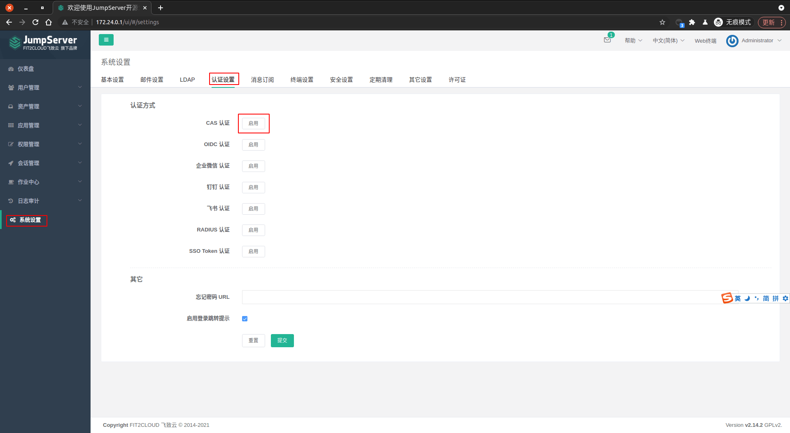
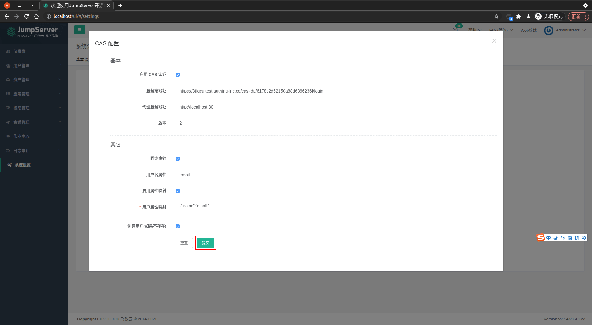

<IntegrationDetailCard :title="`在 JumpServer 中配置 CAS`">

可以选择 `自定义应用` 或者 `应用市场` 来完成应用创建。这里使用 `应用市场` 作为说明。 `自定义应用` 则点击 [这里](/guides/federation/cas.md) 成为 `CAS 身份源`。

配置 JumpServer CAS 登录，你需要有管理员权限。以 `管理员身份` 登录 JumpServer。

进入 **JumpServer**，点击左侧导航栏 **系统设置**，点击 **认证设置**。点击 **启用** CAS 认证。

点击 **设置**。

`启用` **CAS 认证**，`服务端地址` 填写为上一步复制的 **登录页面 URL**。`代理服务地址` 填写自己对应的服务器地址，`版本` 这里填写为 **2**。`用户名属性` 这里填写 **username**（即 {{$localeConfig.brandName}} 中的用户名，不能为空，且不能包含中文，若不满足以上条件，可用其他字段代替），`用户属性映射` 填写 **{"username":"name"}**。其他配置项根据需求进行填写，如图。

<!--  -->

点击 **提交**，完成更改。

</IntegrationDetailCard>
