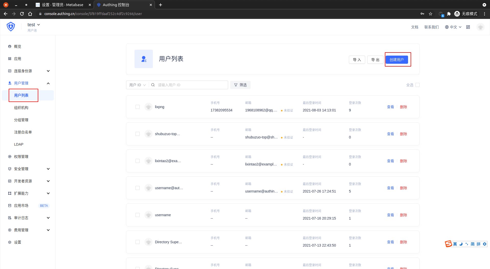
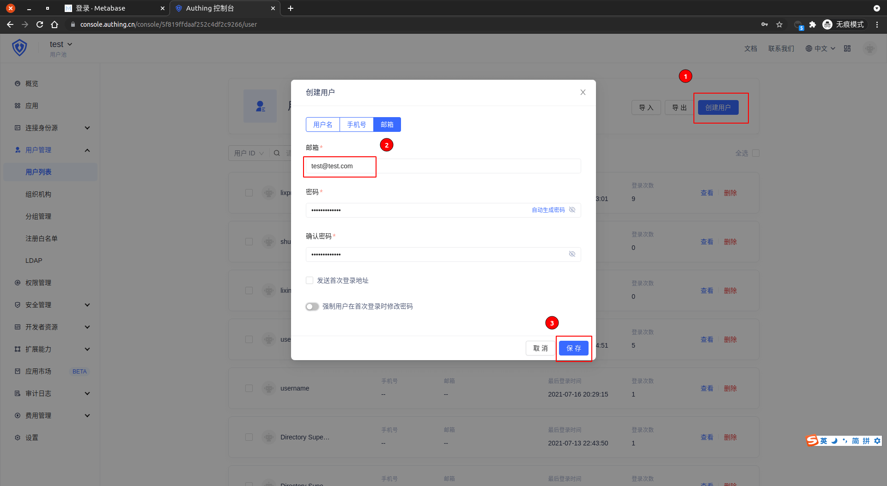
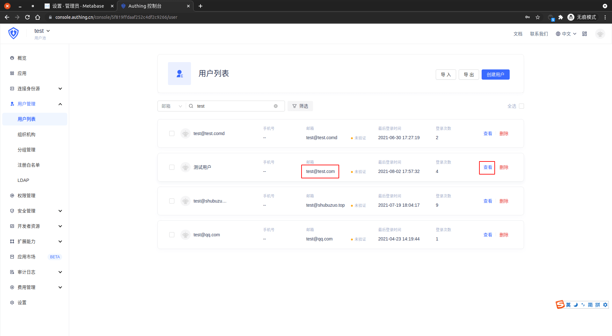
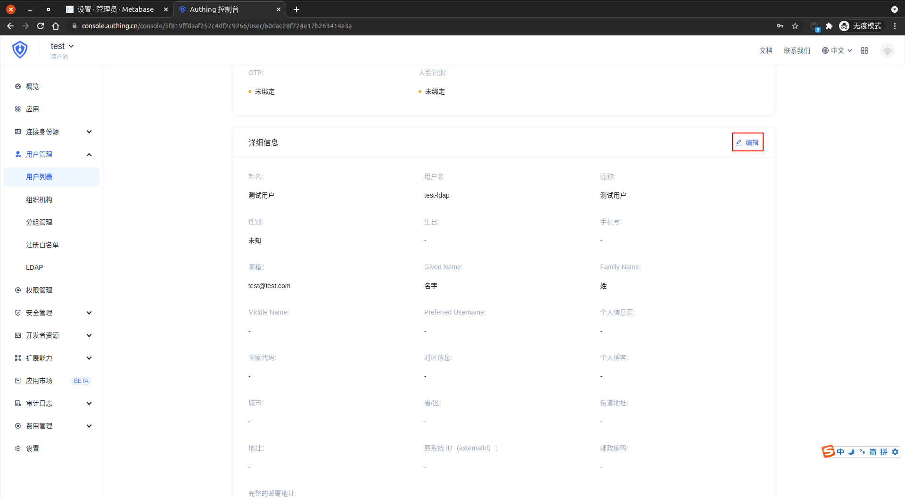
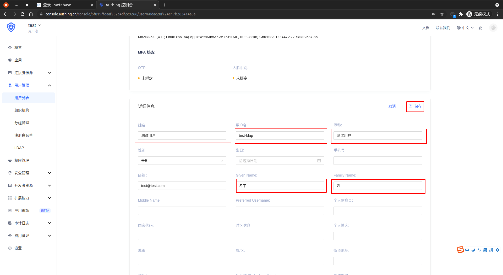

<IntegrationDetailCard :title="`在 ${$localeConfig.brandName} 中创建 CAS 测试用户`">

进入 **{{$localeConfig.brandName}}** 控制台，进入 `用户管理 -> 用户列表`，点击 **创建用户**。

选择 **邮箱** 创建用户，输入对应 `邮箱` 与 `密码`，点击 **保存**。 

进入 **用户列表**， 找到之前创建的 **用户**， 点击 **查看**。

点击 **编辑**，填充相关信息。

填充相关信息，点击 **保存**。

</IntegrationDetailCard>
