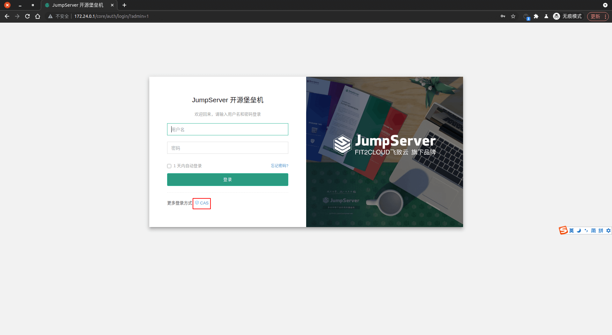
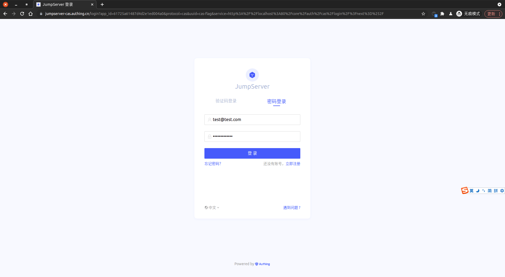
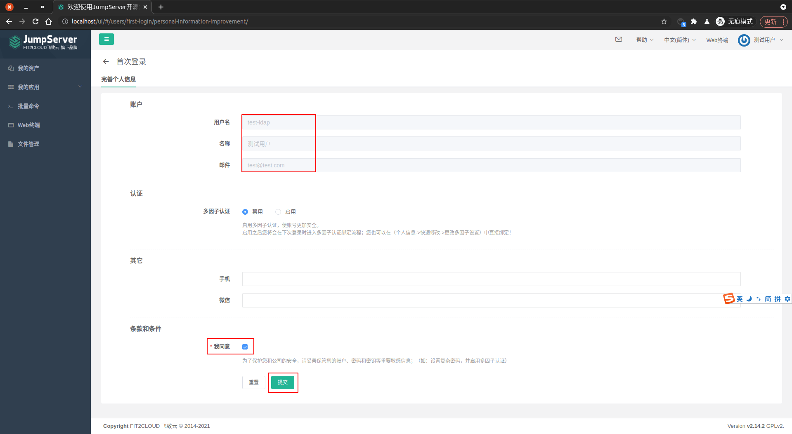
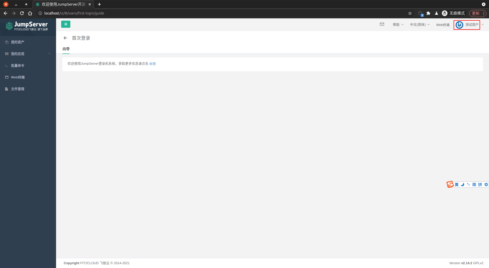

<IntegrationDetailCard :title="`使用 ${$localeConfig.brandName} 登录 JumpServer`">

进入 **JumpServer** 登录页面， `点击` 选择更多登录方式 **CAS**。

::: warning
此时如果在跳转到 {{$localeConfig.brandName}} 登录页时，遇到了 `{"code":400,"message":"当前应用不允许回调到 http://localhost:80/core/auth/cas/login/?next=%2F 请在控制台 > 应用 > URL 设置，配置登录回调 URL"}`，可以排查对应的 **回调地址** 与 **CAS 应用** 中的回调地址是否一致，如果不一致，可以将跳转 URL 中的 `service` 值复制到 **CAS 应用** 的回调地址中（比如 `https://jumpserver-cas.authing.cn/cas-idp/61725a61487d4d2e1ed004a0/login?service=http://localhost:80/core/auth/cas/login/?next=%2F` 中的 `http://localhost:80/core/auth/cas/login/?next=%2F`），即可完成 `登录页正常跳转`。
:::

输入对应的 **测试账密信息**，**点击** 登录。

登录 **成功**，即可看到相关提示信息。点击 **我同意**，完成 **提交**。

此时会进去主页。

至此，已完成 `使用 {{$localeConfig.brandName}} CAS 服务登录 JumpServer `。 :tada: :100: :tada: :100: :tada: :100:

</IntegrationDetailCard>
