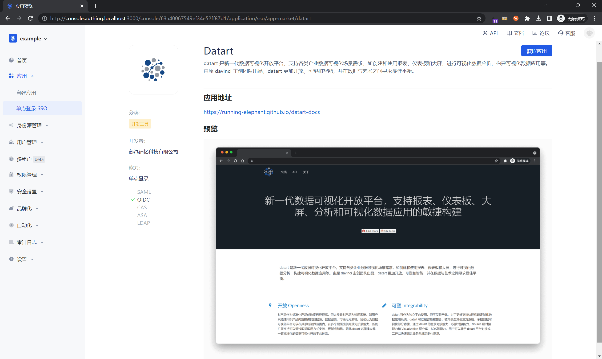
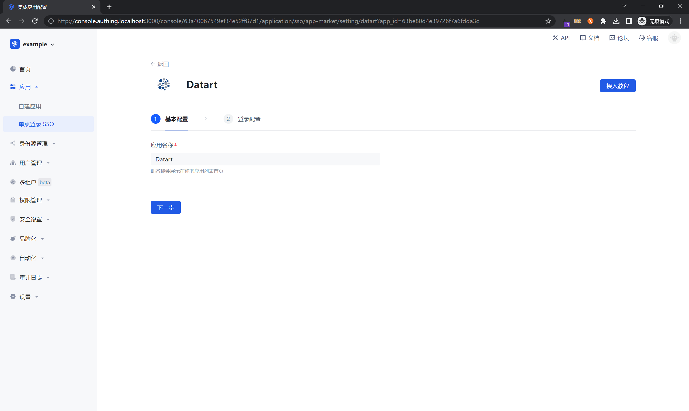
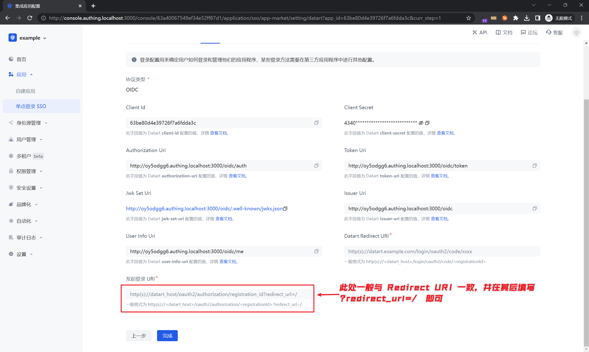
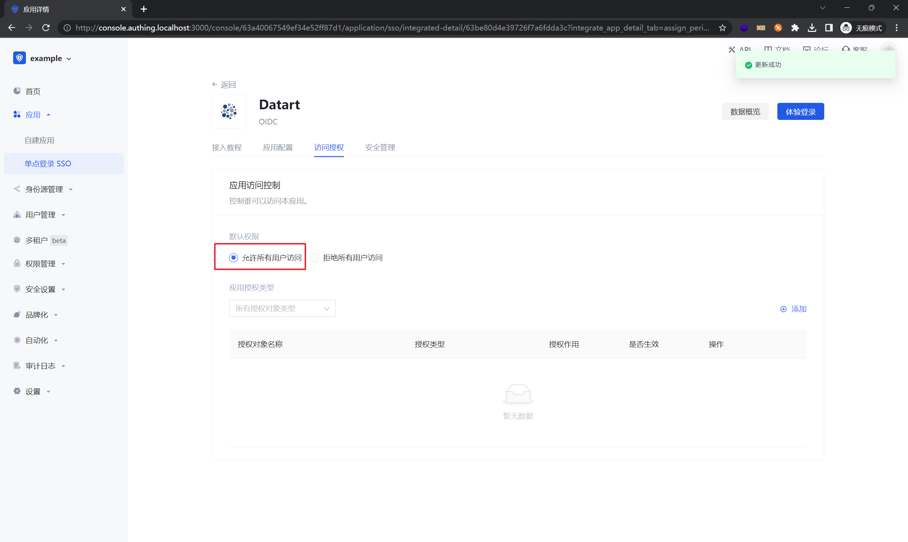

<IntegrationDetailCard :title="`在 ${$localeConfig.brandName} 中创建应用`">

进入[**控制台**](https://console.authing.cn) > **单点登录 SSO** > **添加应用** ，点击 Datart，点击获取应用。

填写应用名称，点击下一步。

填写 `Datart Redirect URI`，点击「完成」。
发起登录 URI 一般与 `Datart Redirect URI` 一致，在其后添加 `?redirect_url=/` 即可。

在访问授权页点击「允许所有用户访问」（可以按照实际需求给部分用户授权）。

</IntegrationDetailCard>
