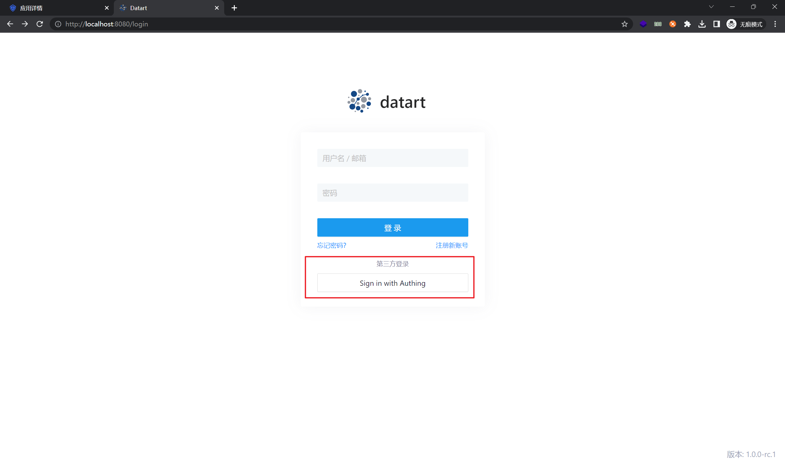

<IntegrationDetailCard title="体验登录">

在 {{$localeConfig.brandName}} 中进入刚刚创建的应用的详情页，点击「体验登录」，或者直接访问 Datart 登录界面。

点击「Sign In Authing」，会跳转到 {{$localeConfig.brandName}} 的登录页面，输入账密登录，即可登录成功。

</IntegrationDetailCard>
