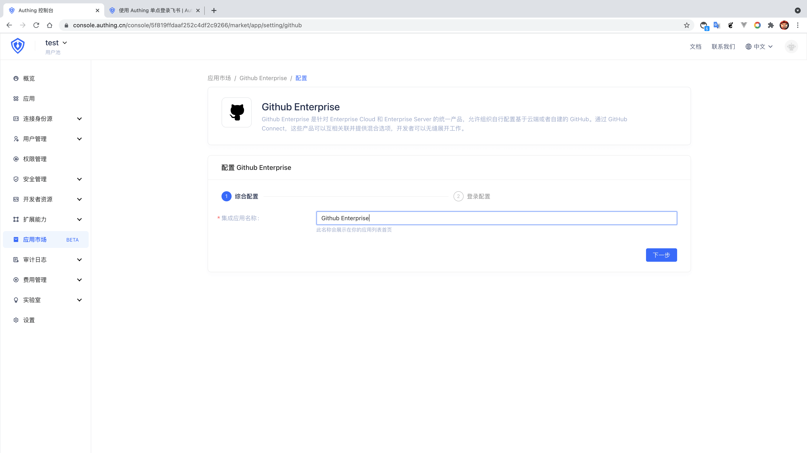
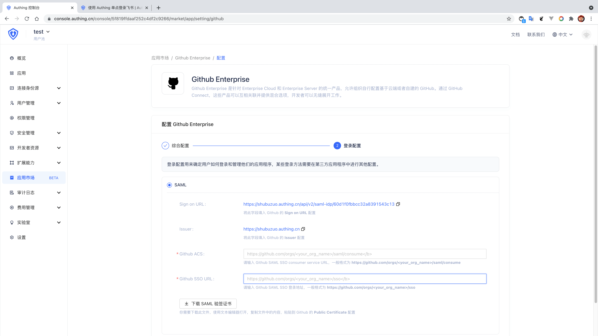
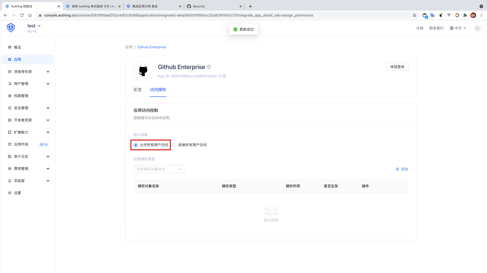
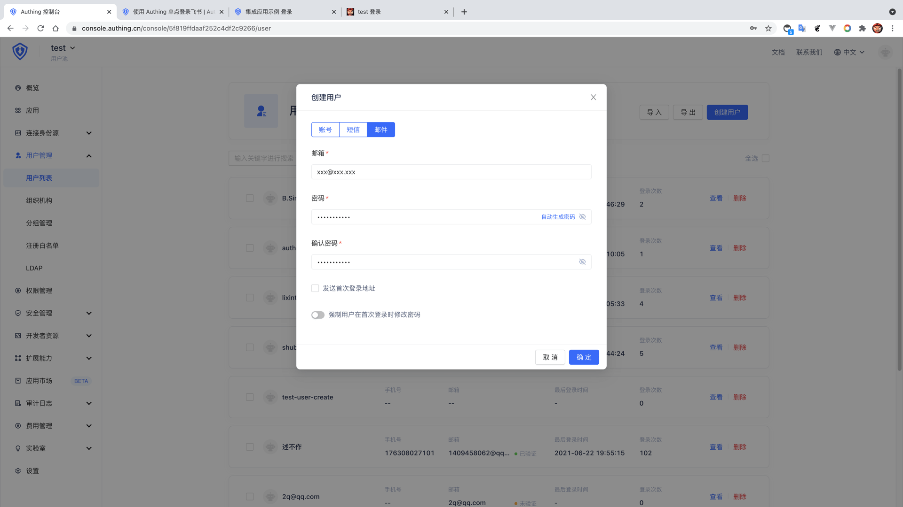

<IntegrationDetailCard :title="`在 ${$localeConfig.brandName} 中创建应用`">

进入[**控制台**](https://console.authing.cn) > **单点登录 SSO** > **添加应用** ，找到**GitHub Enterprise**，点击进入详情，然后点击获取应用。

输入应用名称，点击下一步。

输入你的 **GitHub ACS** 与 **GitHub SSO URL** ，**GitHub SAML SSO consumer service URL**，一般格式为 **https://github.com/orgs/<your_org_name>/saml/consume**，**GitHub SAML SSO 登录地址**，一般格式为 **https://github.com/orgs/<your_org_name>/sso**，同时「下载 SAML 验签证书」。

点击完成，在访问授权页点击「允许所有用户访问」。

然后回到用户列表，创建一个**邮箱已经在 GitHub Enterprise 团队**中存在的用户。

</IntegrationDetailCard>
