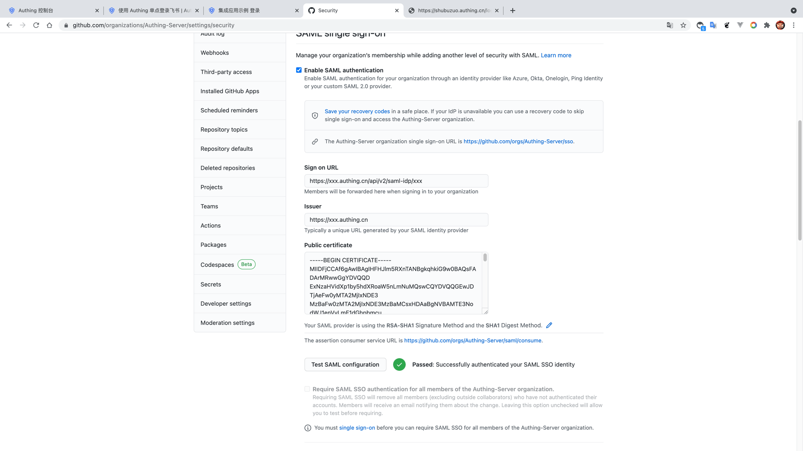
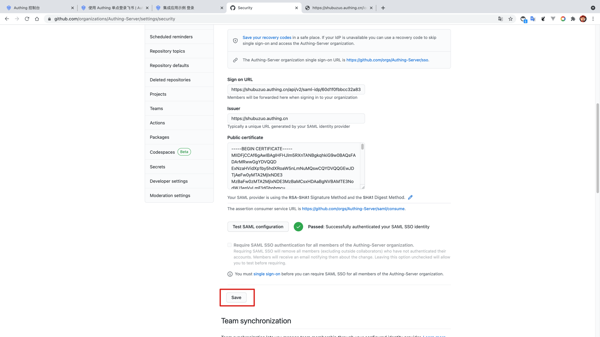

<IntegrationDetailCard title="配置 GitHub Enterprise SSO 登录">

配置 GitHub Enterprise SSO 登录，你需要有管理员权限。进入 **setting**，切换组织到目标组织，找到 **Organization security** -> **SAML single sign-on**，点击 **Enable SAML authentication**，允许 **SAML 单点登录配置**。

填入 {{$localeConfig.brandName}} 中对应的 **Sign on URL**、**Issuer**；另外，用文本编辑器打开上一步下载的 **SAML 验签证书**，复制 **-----BEGIN CERTIFICATE-----** 和 **-----END CERTIFICATE-----** 之间的内容，粘贴到 **GitHub Enterprise** 的 **Public Certificate** 字段，点击「Test SAML configuration」。

在登录界面输入上一步创建的用户的账号密码，点击登录。

登录完成后，会回调到 GitHub Enterprise SSO 配置页，显示验证成功，然后点击**Save**， 保存 SSO 配置。

</IntegrationDetailCard>
