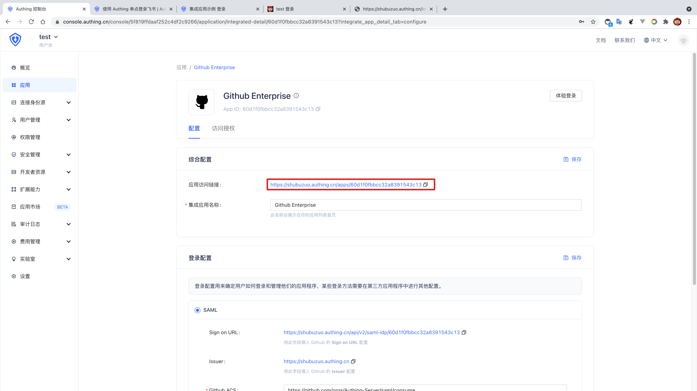
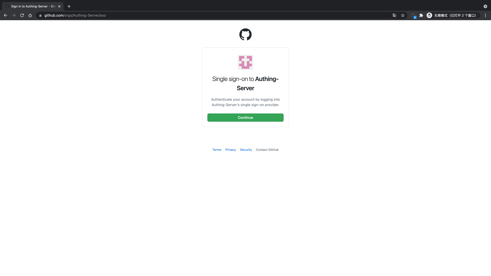
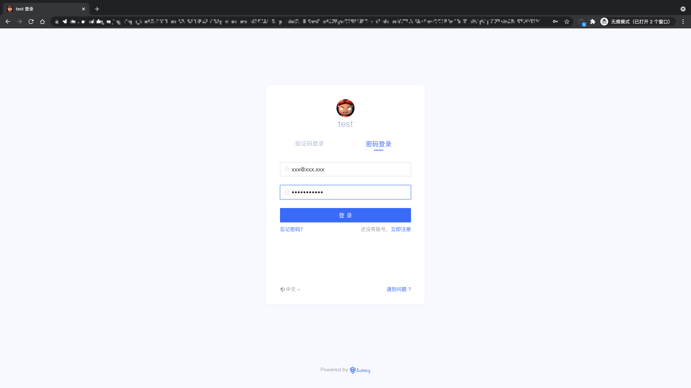
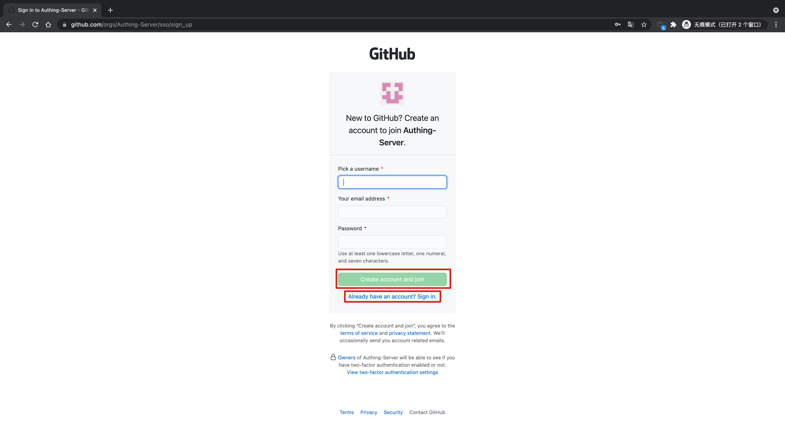
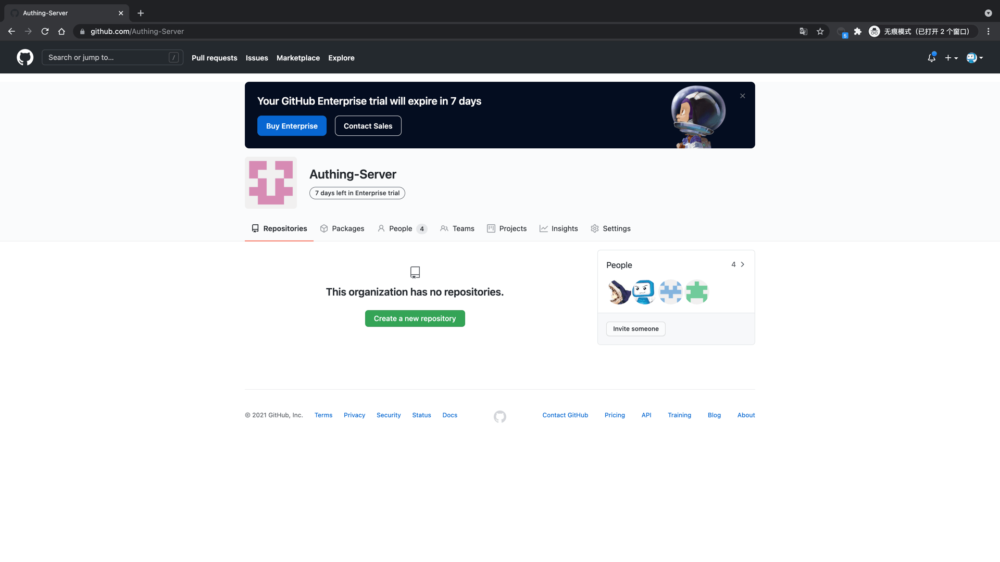

<IntegrationDetailCard title="体验登录">

复制应用访问链接，在新的浏览器隐身窗口中打开。

跳转到 **GitHub Enterprise** 登录页，点击 「Continue」。

进入 **Authing** 登录页面。

在登录界面输入之前创建的用户账号密码，即可成功登录到 **GitHub Enterprise**。

选择对应的策略即可加入 **GitHub Enterprise** 对应组织，成为其中成员（只针对于第一次）。

</IntegrationDetailCard>
