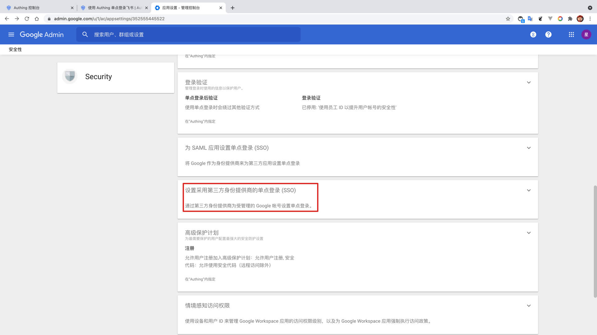

<IntegrationDetailCard title="配置 Google Workspace SSO 登录">

配置 Google Workspace SSO 登录，你需要有管理员权限。进入 **管理控制台**，进入 **设置目录** ，找到 **安全性** -> **设置**。

点击 **设置采用第三方身份提供商的单点登录（SSO）**。

允许 **设置采用第三方身份提供商的单点登录**。

填入 {{$localeConfig.brandName}} 中对应的 **登录页网址**、**退出页网址**；另外，将下载的 **SAML 验签证书**，上传到 **验证证书**。

点击**保存**。

</IntegrationDetailCard>
