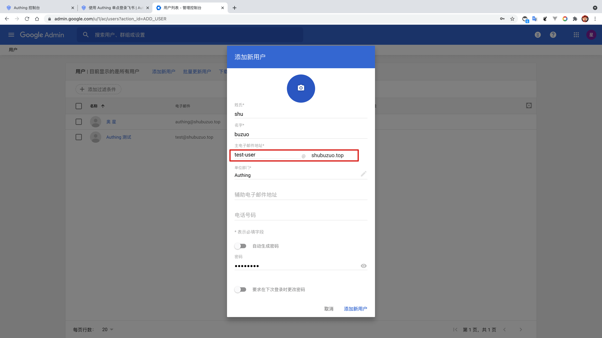
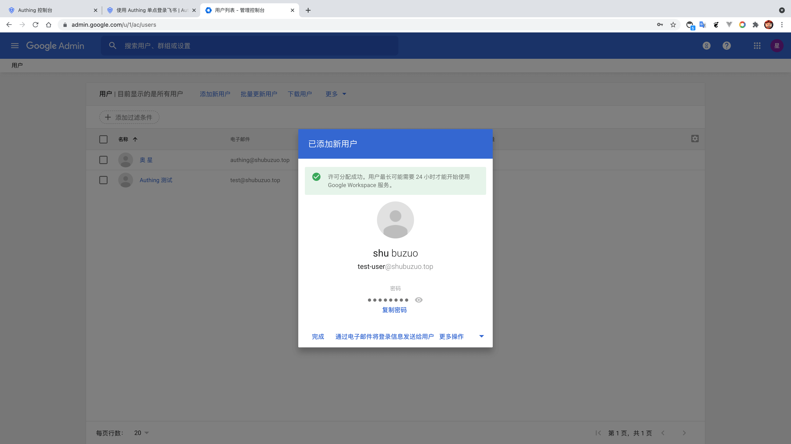
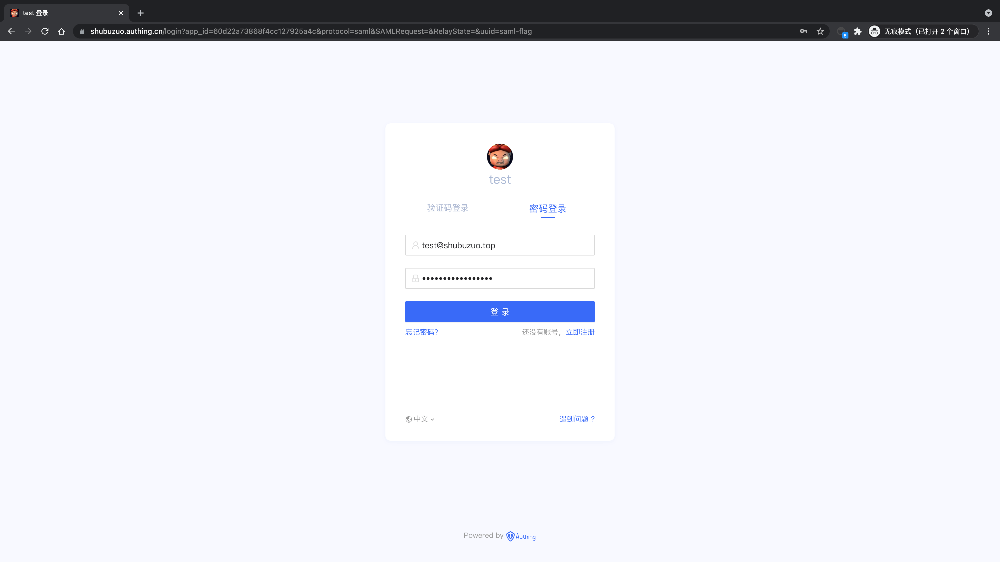

<IntegrationDetailCard title="体验登录">

在 **Google Workspace** 中进入 **用户面板**，新增用户，注意该用户的 **邮箱地址**。

点击 **添加新用户**，新增成功。

复制应用访问链接，在新的浏览器隐身窗口中打开。

进入 **Authing** 登录页面。

在登录界面输入之前创建的用户账号密码，即可成功登录到 **Google Workspace**。

</IntegrationDetailCard>
