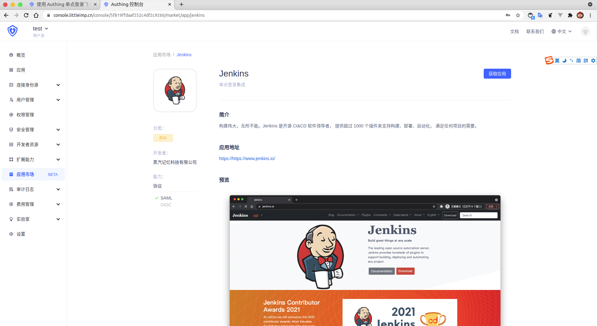
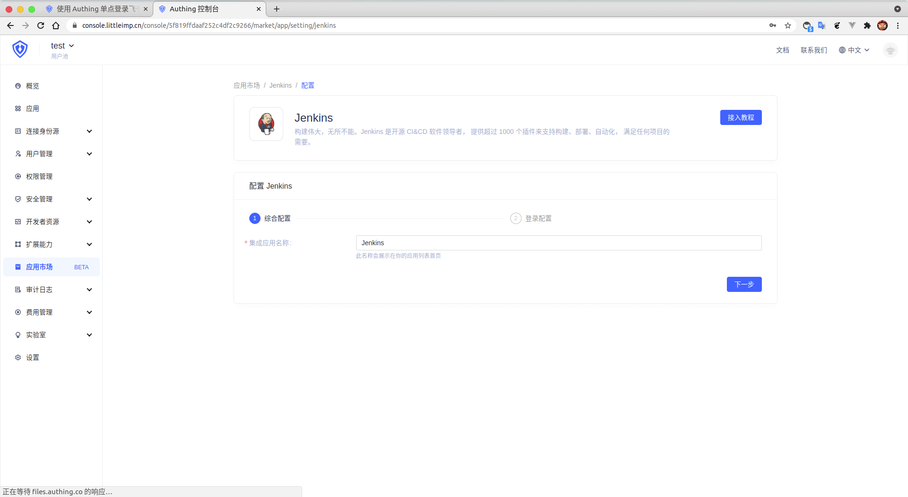
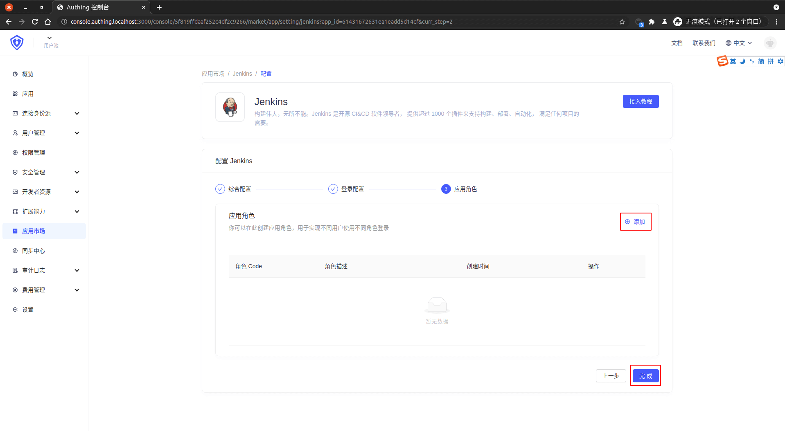
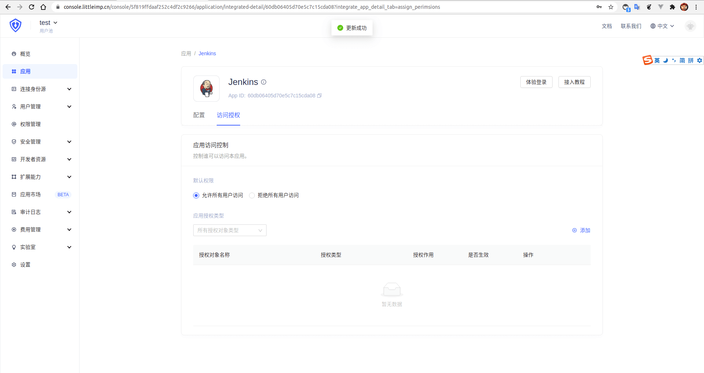

<IntegrationDetailCard :title="`在 ${$localeConfig.brandName} 中创建应用`">

进入[**控制台**](https://console.authing.cn) > **单点登录 SSO** > **添加应用** ，找到 **Jenkins**，点击进入详情，然后点击获取应用。

输入应用名称，点击下一步。

输入你的 **Jenkins 域名** 和 **Jenkins ACS URL**，其中 **Jenkins ACS URL** 即 **SAML SSO consumer service URL**，一般格式为 **http://&lt;SERVER_HOSTNAME&gt;:&lt;PORT&gt;/securityRealm/moSamlAuth**（注意该配置项是由 Jenkins SAML 插件自动生成的），同时「**下载 SAML 证书**」。

进入 **应用角色**，如果需要配置角色映射可以直接跳转到 **当前文档第四步**，并执行 **添加** 操作以及后续相关操作。不需要则直接点击完成。

在访问授权页点击「允许所有用户访问」。

</IntegrationDetailCard>
