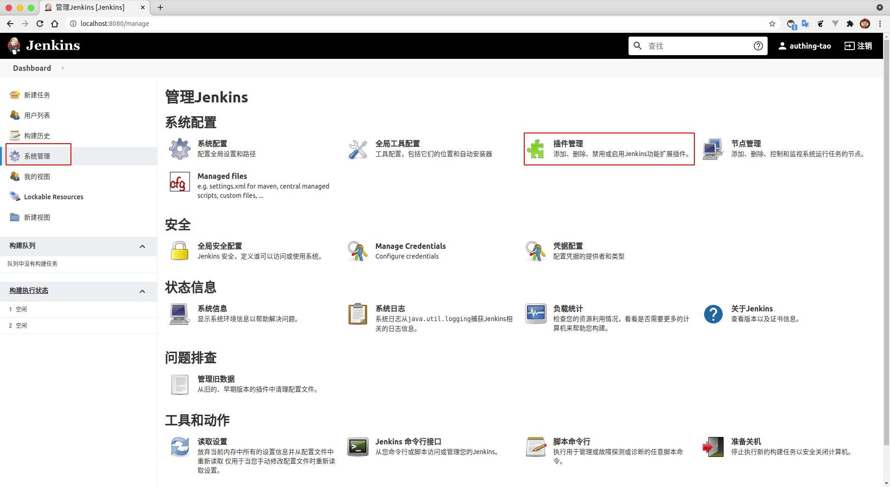
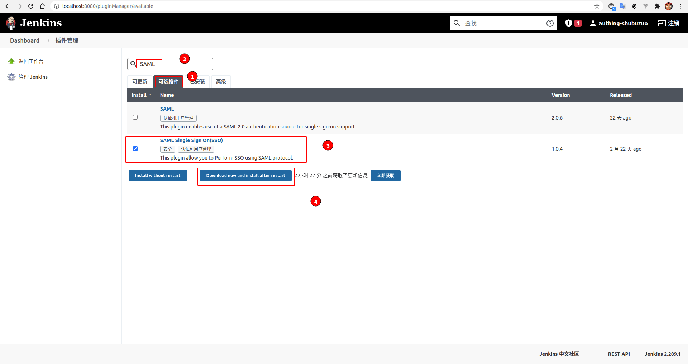
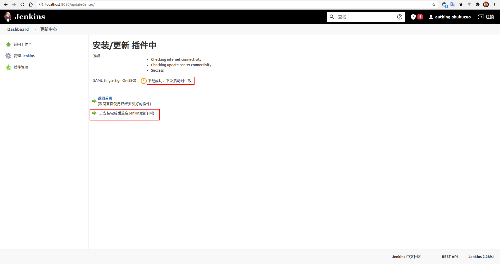
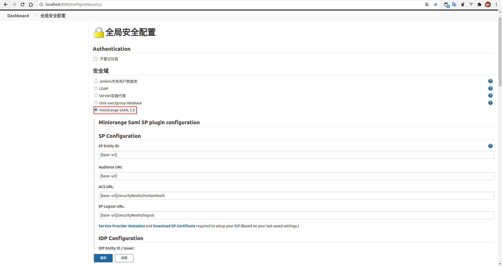
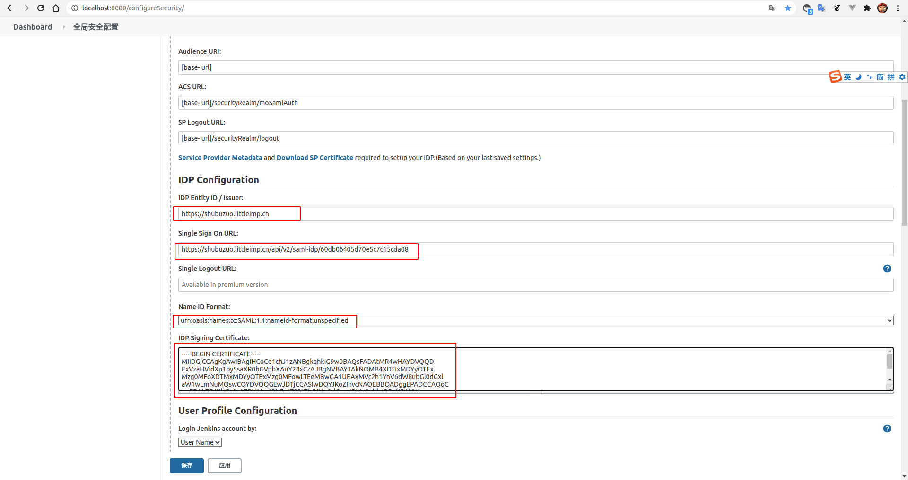
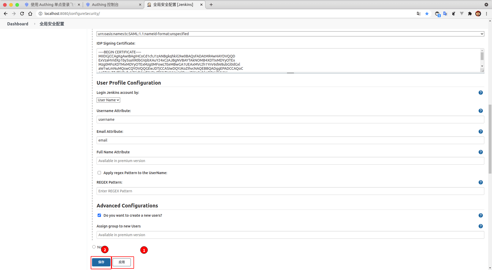

<IntegrationDetailCard title="配置 Jenkins SSO 登录">

配置 Jenkins SSO 登录，你需要有管理员权限。进入**Dashboard**，点击**系统设置**，找到**插件管理**。

选择 **可选插件**，**搜索框** 输入 **SAML**，可以得到两个搜索结果，选择如图所示插件 **SAML Single Sign On(SSO)**。

下载成功后，将受到相关提示，如果你想启用插件需要 **重启** `Jenkins`(这可能是一个危险操作，需要考虑具体场景)。

进入**Dashboard**，点击**系统设置**，找到**全局安全配置**。

**启用** `miniOrange SAML 2.0`。

填入 {{$localeConfig.brandName}} 中对应的 **IDP Entity ID / Issuer**，**SAML Single Sign On URL**；选择 **Name ID Format** 为 `urn:oasis:names:tc:SAML:1.1:nameid-format:unspecified`，另外，复制 **证书**，粘贴到 **Jenkins 的 IDP Signing Certificate**。

对于 **User Profile Configuration**， **Login Jenkins account by** 选择 **User Name**，**Username Attribute** 填写 **username**，**Email Attribute** 填写 **email**， **Advanced Configurations** 选择 **是否新建用户**（根据需要进行选择）。

依次点击 **应用**，**保存**。

</IntegrationDetailCard>
