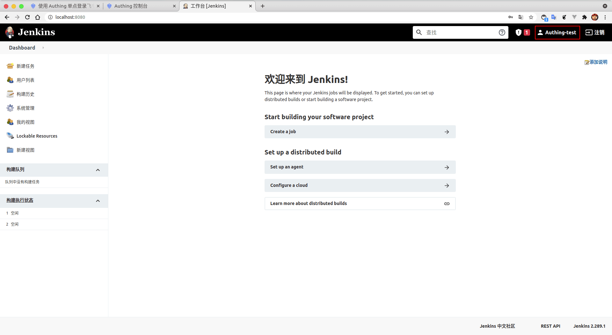

<IntegrationDetailCard title="体验登录">

进入 **Jenkins**，点击右上角 **注销**，进入 **登录** 页面。

点击 **Login with IDP**，进入 **Authing** 登录界面，在登录界面输入的用户账号密码，完成校验。

之后跳转到 **Jenkins**，即成功实现登录 **jenkins**。

</IntegrationDetailCard>
