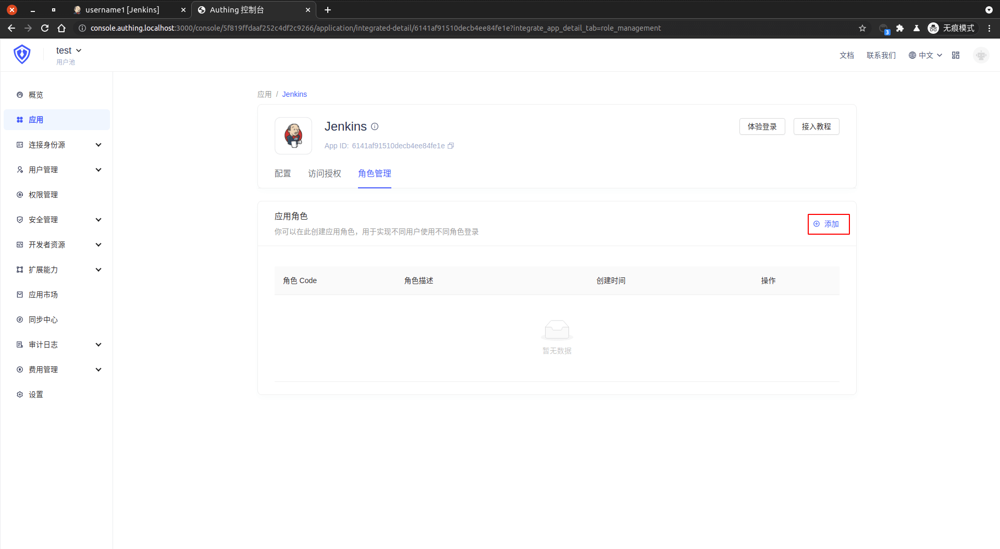
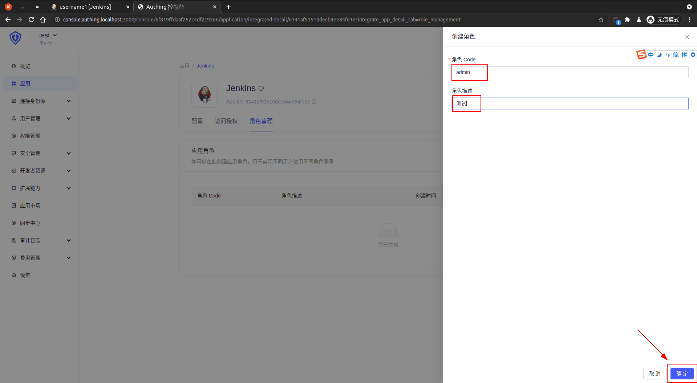
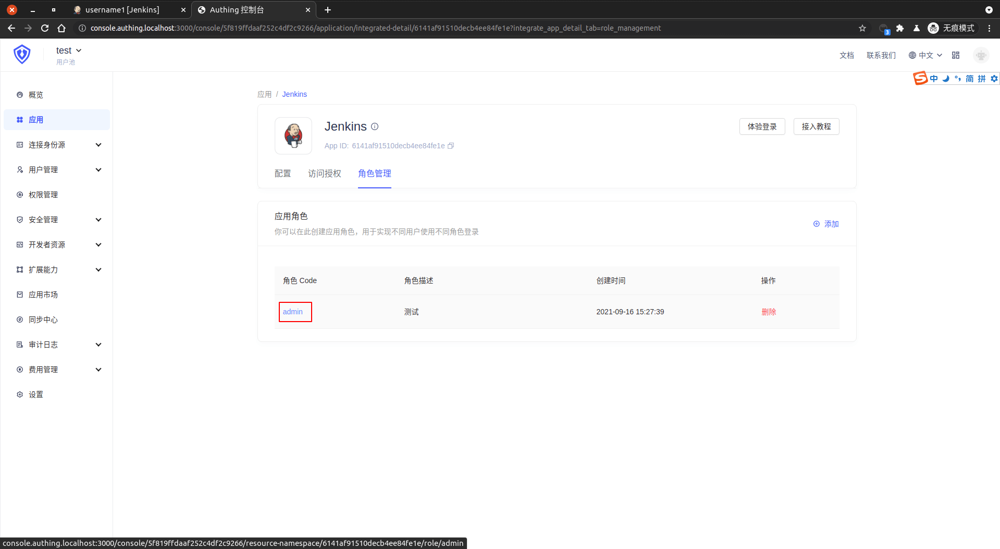
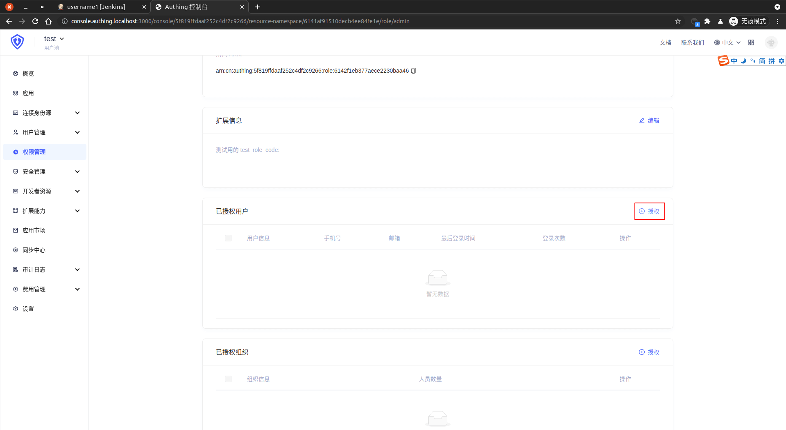
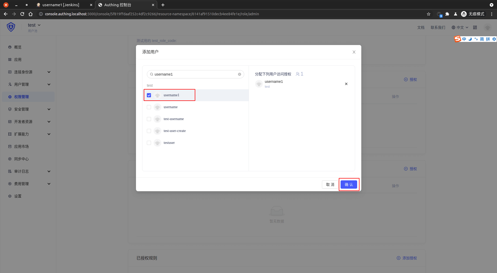
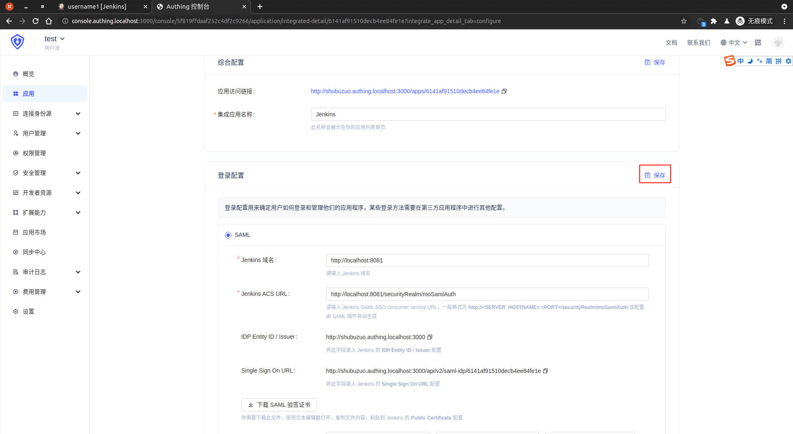
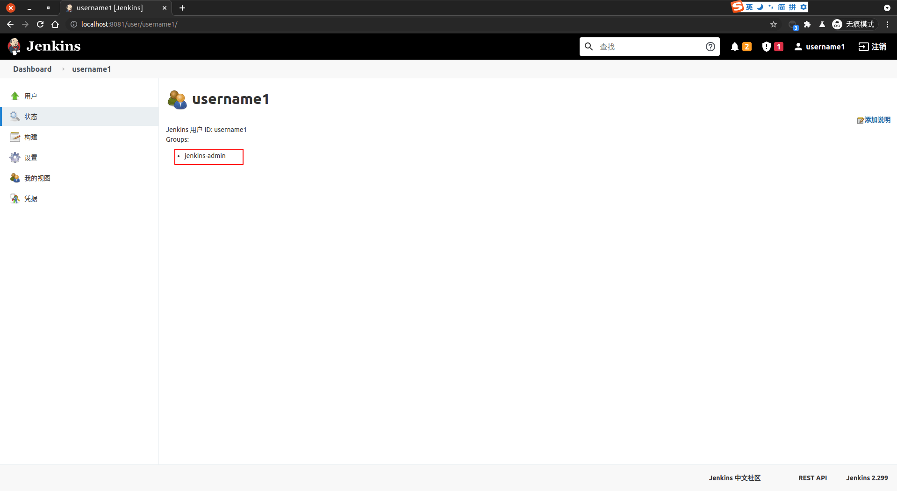
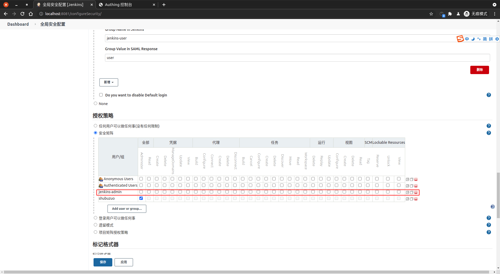
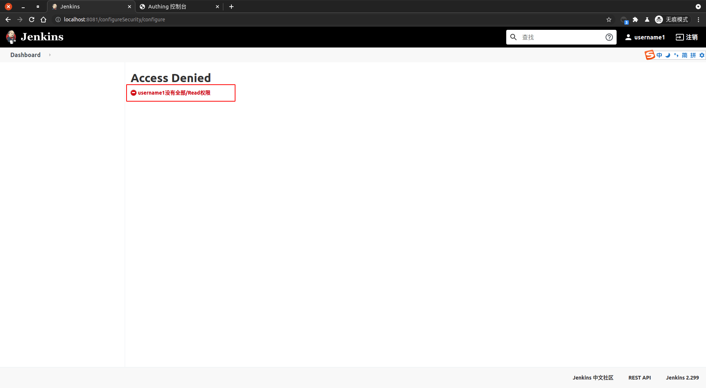

<IntegrationDetailCard title="Jenkins 安全矩阵登录">

进入 {{$localeConfig.brandName}} 中 `Jenkins 应用配置`，选择 `角色管理`，点击添加。

创建角色，角色 Code 为 `admin`，点击 `确定` 保存。此处的 `admin` 与 之前在 `Jenkins` 中的 `组之间的映射关系` 有关联，这里创建的正好是之后需要映射的组。

点击应用角色名 **admin**，进入应用角色详情。

点击 **授权**。

**添加** 对应用户，点击 **确认**。

进入 {{$localeConfig.brandName}} 中 `Jenkins 应用配置`，选择 `配置`， `自定义 SAML Response 属性`， 添加 **group** 属性，类型为 **Basic**，值为 **${user.roles[0].code}**。

**点击** 保存，完成更改。

进入 **Jenkins**，点击右上角 **注销**，进入 **登录** 页面。点击 **Login with IDP**，进入 **Authing** 登录界面，在登录界面输入的用户账号密码，完成校验。此处应该输入加入对应角色用户的账号与密码。之后跳转到 **Jenkins**，即成功实现登录 **jenkins**。

点击 `用户名`，查看个人信息。可以看到登录的用户自动映射到了 `jenkins-admin` 用户组。

修改 `jenkins-admin` 权限，将所有权限取消。依次 **点击** `应用` -> `保存`。

刷新页面，将看到权限不足相关提示。

至此，完成了 **Authing** 与 **Jenkins 安全矩阵** 的权限映射。

</IntegrationDetailCard>
