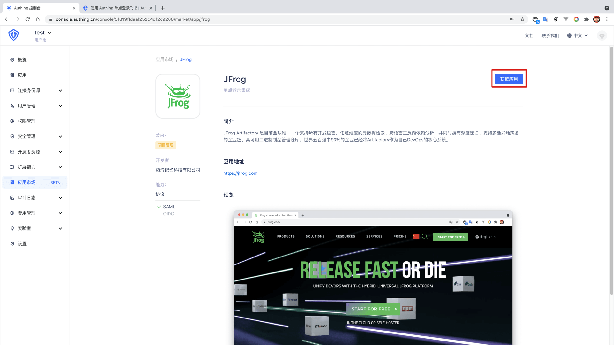
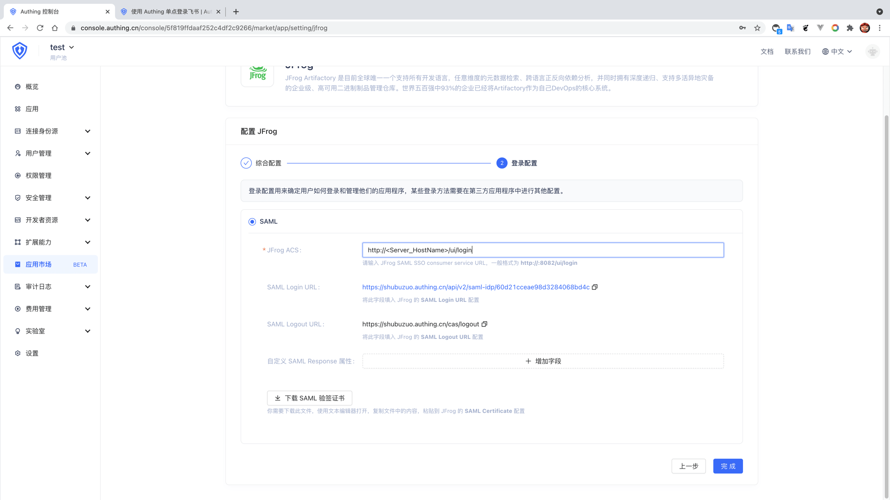
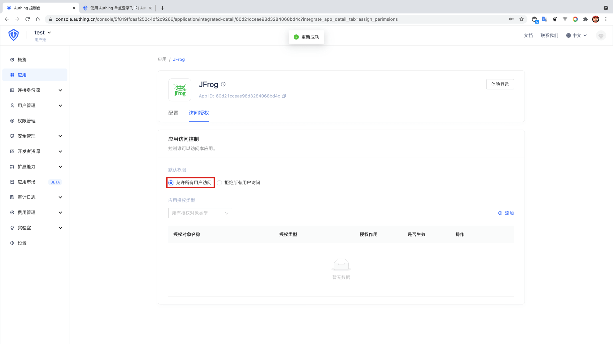
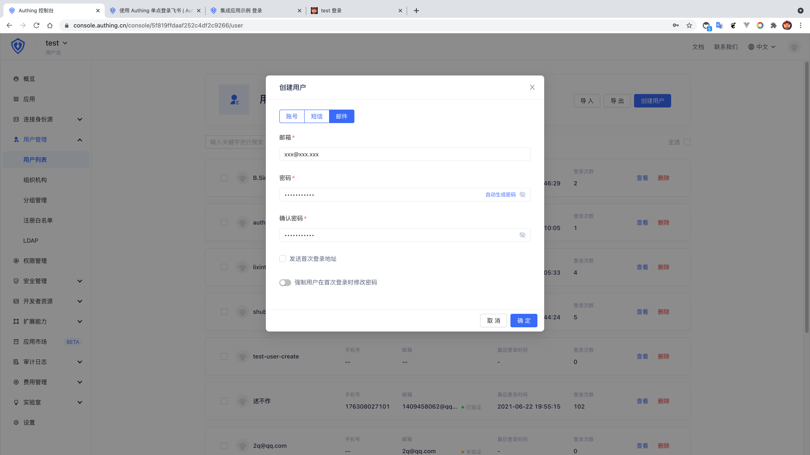

<IntegrationDetailCard :title="`在 ${$localeConfig.brandName} 中创建应用`">

进入[**控制台**](https://console.authing.cn) > **单点登录 SSO** > **添加应用** ，找到 **JFrog** ，点击进入详情，然后点击获取应用。

输入应用名称，点击下一步。

输入你的 **JFrog ACS** ，**JFrog SAML SSO consumer service URL**，一般格式为 **https://<Server_HostName>/ui/login**，同时「下载 SAML 验签证书」。

点击完成，在访问授权页点击「允许所有用户访问」。

然后回到用户列表，创建一个**邮箱已经在 JFrog 团队**中存在的用户。(如果在 **JFrog** 中 **SAML 配置** 选择了 **新建 SAML 用户（Auto Create Artifactory Users）** 则无需考虑 **邮箱已经在 JFrog 团队**)。

</IntegrationDetailCard>
