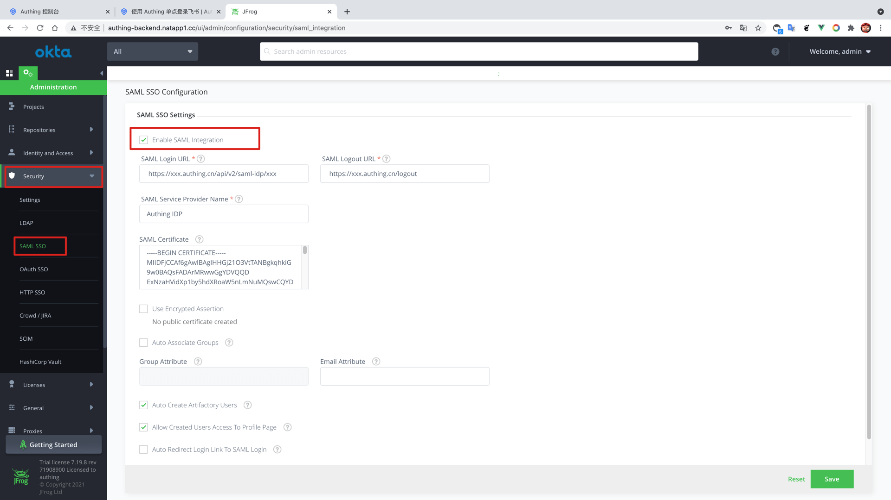

<IntegrationDetailCard title="配置 JFrog SSO 登录">

配置 JFrog SSO 登录，你需要有管理员权限。进入 **管理控制台**，进入 **安全**，找到 **SAML SSO**，允许 **Enable SAML Integration**。

填入 {{$localeConfig.brandName}} 中对应的 **SAML Login URL**、**SAML Logout URL**；另外，将下载的 **SAML 验签证书**，复制其内容到 **SAML Certificate**，根据自己需要选择对应的 **SAML 选项**，点击保存。

成功保存 **SAML 配置**。

</IntegrationDetailCard>
