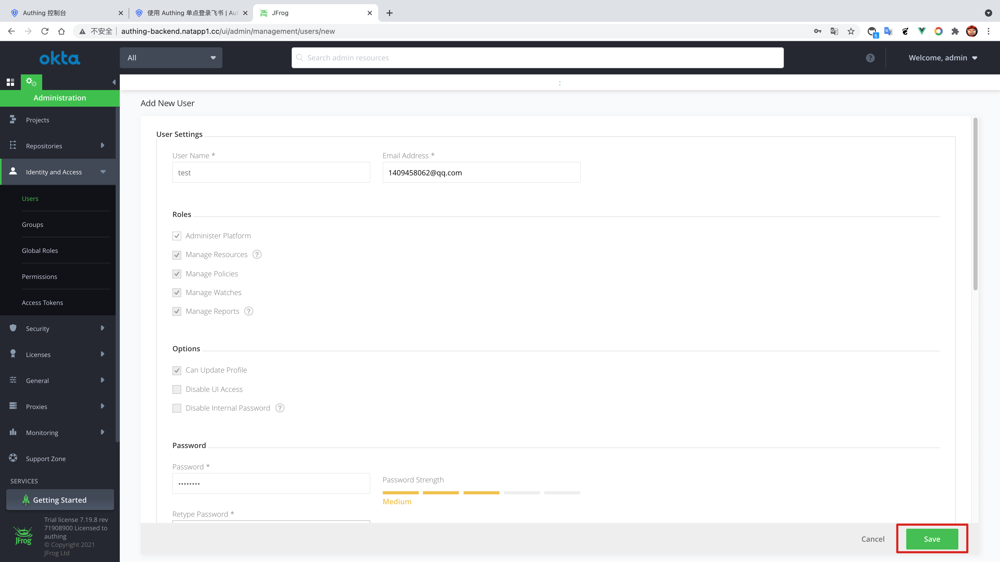
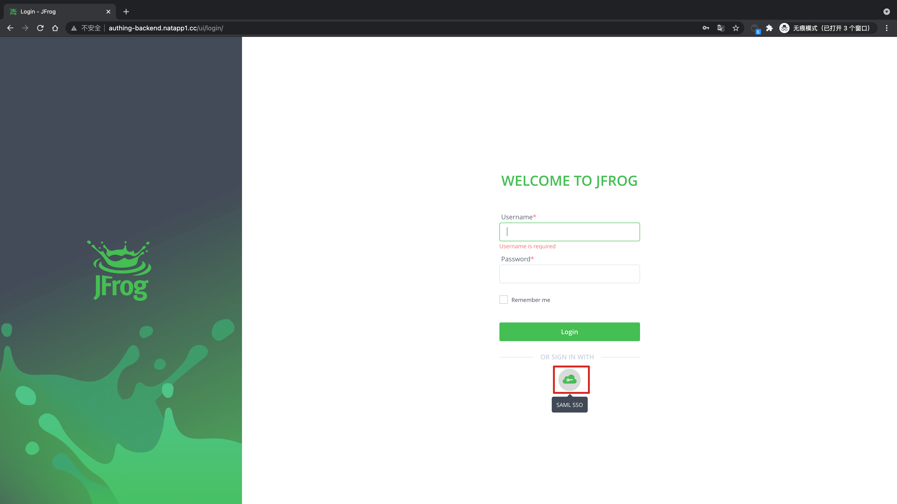
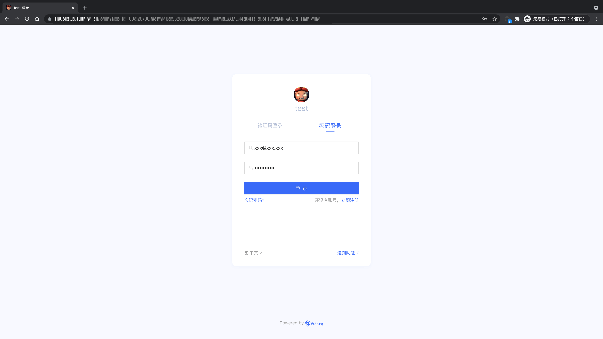

<IntegrationDetailCard title="体验登录">

在 **JFrog** 中进入**Identity and Access** -> **Users**，新增用户。

填写用户相关信息，注意该用户的**邮箱地址**, 点击 **Save**。

**新增用户成功**。

退出当前用户登录，进入登录界面，选择 **SAML SSO**。

进入 **Authing** 登录页面。

在登录界面输入之前创建的用户账号密码，即可成功登录到 **JFrog**。

</IntegrationDetailCard>
