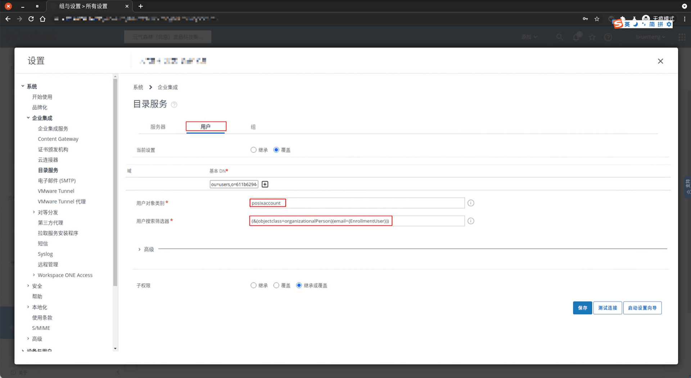
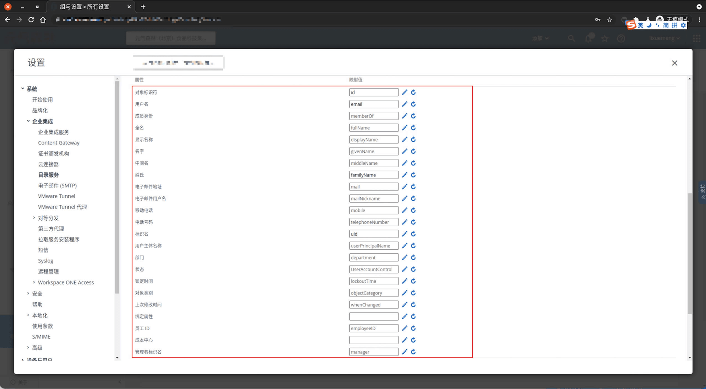
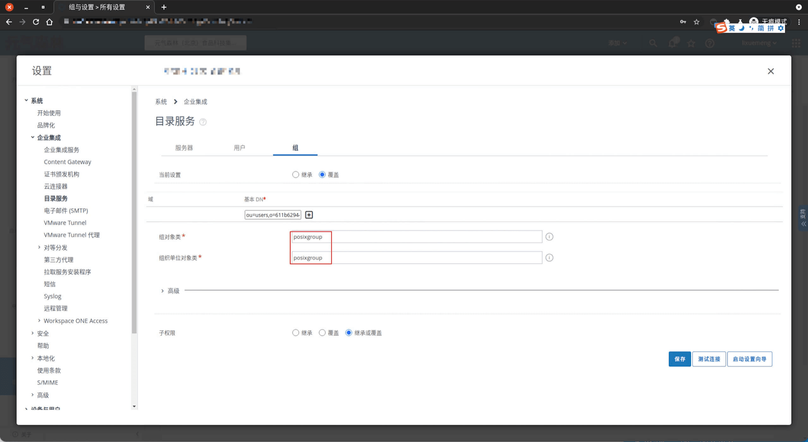
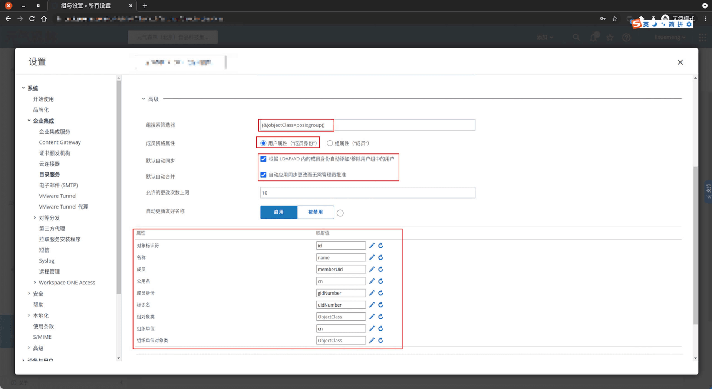
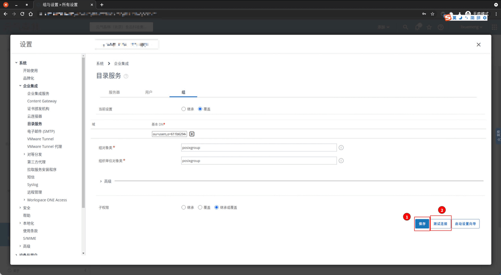

<IntegrationDetailCard :title="`在 AirWatch 中配置 LDAP`">

配置 AirWatch LDAP 相关，你需要有管理员权限。进入 **AirWatch**。

点击侧边栏 `组与设置` -> `所有设置`。

点击 `系统` -> `企业集成` -> `目录服务`。

选择 `目录类型` 为 **LDAP-其他LDAP**，`服务器` 为 **LDAP URL**，`加密类型` 为 **无**，`端口` 为 **Port**，`协议版本` 为 **3**，`使用服务账户凭证` 为 **被禁用**，`绑定身份验证类型` 为 **基本**，`绑定用户名` 为 **Bind DN**，`绑定密码` 为 **Password**。`LDAP URL`、`Port`、`Bind DN` 信息可以在 **{{$localeConfig.brandName}}** 控制台上查看，对应位置如图。 `Password` 则为 **{{$localeConfig.brandName}}** 控制台 `设置 -> 用户池秘钥`。

点击 `保存`，完成配置项保存。

点击 `用户`，配置 `用户` 相关信息，`用户对象类别` 为 **posixAccount**，`用户搜索筛选器` 为 **(&(objectclass=organizationalPerson)(email={EnrollmentUser}))**， 点击 `高级` 配置 **字段映射规则**。

以下为 **字段映射规则** 默认参考。

点击 `组`，配置 `组` 相关信息，`组对象类别` 为 **posixGroup**，`组织单位对象类别` 为 **posixGroup**。

点击 `高级` 继续配置，`组搜索筛选器` 为 **(&(objectClass=posixgroup))**，`成员资格属性` 为 **用户属性（"成员身份"）**，勾选 **默认自动合并**，勾选 **默认自动合并**。 配置 **字段映射规则**。以下为 **字段映射规则** 默认参考。

点击 **保存**，点击 **测试连接**。

</IntegrationDetailCard>
