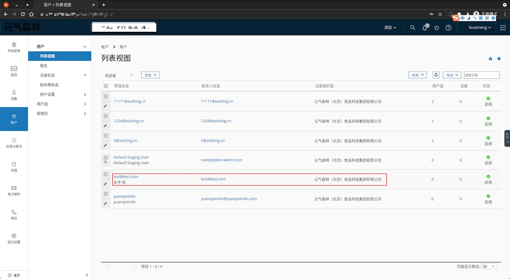

<IntegrationDetailCard :title="`使用 ${$localeConfig.brandName} 导入用户及组到 AirWatch`">

进入 **AirWatch** LDAP 用户测试页面，输入对应的 **用户名**，**点击** 检查用户。

进入 **AirWatch** LDAP 组测试页面，选择 `外部类型` 为 **组织单位**， 输入对应的 **节点名**，**点击** 检查组。

点击左侧导航 `账户` -> `用户` -> `列表视图`。

点击 **添加**，点击 **添加用户**，选择 **目录**，输入 **用户名**。

点击 **检索用户**，补充必要的用户信息。点击 **保存**。

添加完成，自动跳转到 `列表视图` ，可以看到之前新增的用户。

同样，点击左侧导航 `账户` -> `用户组` -> `列表视图`。

点击 **添加**，点击 **添加用户组**。

`类型` 选择 **目录**，`外部类型` 选择 **组织单位**，`搜索文本输入` 组名。

点击 **检索**，完成 **组信息查询**，点击 **保存**，完成 **组新增**。

添加完成，自动跳转到 `列表视图` ，可以看到之前新增的用户组。

点击之前新增的 **Users** 组，进入组详情。点击 **同步**，进行组相关信息同步。

**确认** 进行同步。

**同步完成** 会自动跳转到 `列表视图` ，可以看到用户组的最新状态。

点击之前新增的 **Users** 组，进入组详情。点击 **用户**。

查看 **成员用户详情**。

至此已完成 **AirWatch 用户与组** 信息的相关导入，对于 AirWatch 的单点登录会使用 `SAML 2.0`。

</IntegrationDetailCard>
