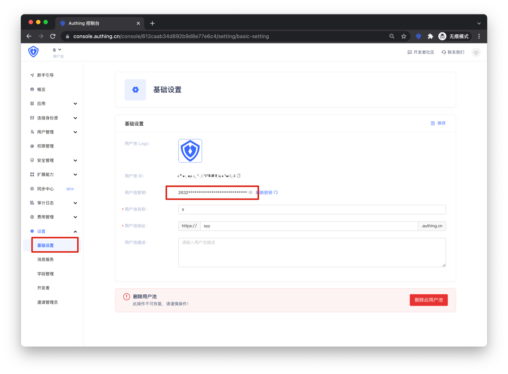

<IntegrationDetailCard :title="`从 ${$localeConfig.brandName} 中获取 LDAP 配置信息`">

进入[**控制台**](https://console.authing.cn) > **用户管理 &gt; LDAP**，点击 **使用文档**，复制 `Base DN`

进入**设置 &gt; 基础设置**，复制 `用户池密钥`

</IntegrationDetailCard>
