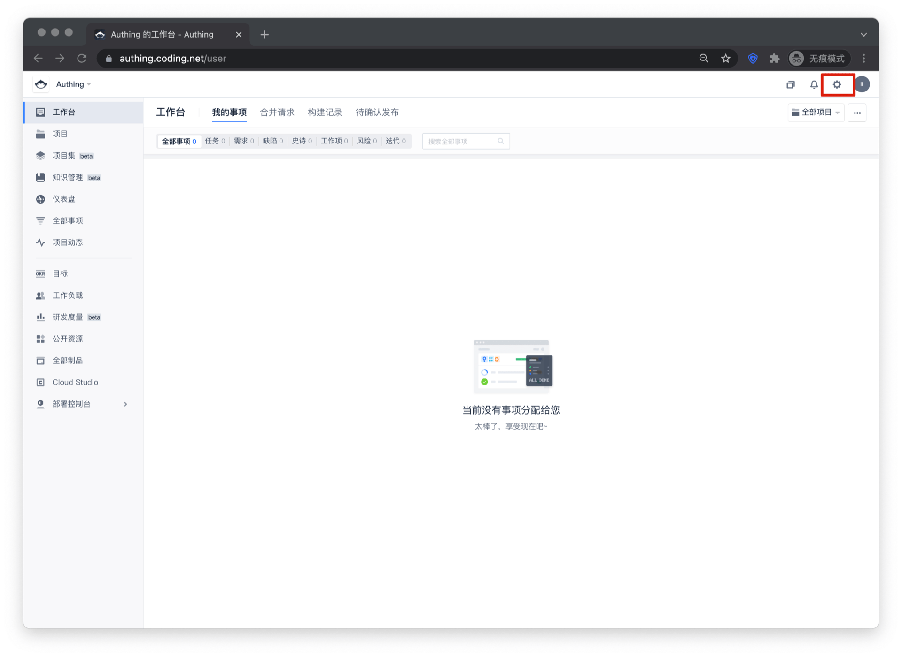

<IntegrationDetailCard :title="`在 CODING 中配置 LDAP`">

管理员账号登录 CODING 的工作台，点击右上角的设置图标

点击**第三方应用**

点击 **AD/LDAP** 后面的**绑定**按钮

- 目录类型：OpenLDAP
- 服务器地址：ldap.authing.cn
- 端口：1636，勾选 **使用 SSL**
- Base DN：上一步复制的 Base DN
- 管理员账号：上一步复制的 Base DN
- 管理员密码：上一步复制的用户池密钥
- LDAP 密码加密：simple
- 点击下一步

- 成员过滤属性：{objectClass=posixaccount}
- 成员唯一 ID 属性：uid
- 成员姓名属性：cn
- 成员登录属性：cn 或者 email，cn 表示 用户名，email 表示用户邮箱
- 成员邮箱属性：email
- 成员手机号属性：phone
- 点击下一步

第三步可不填写，直接点击**提交**

</IntegrationDetailCard>