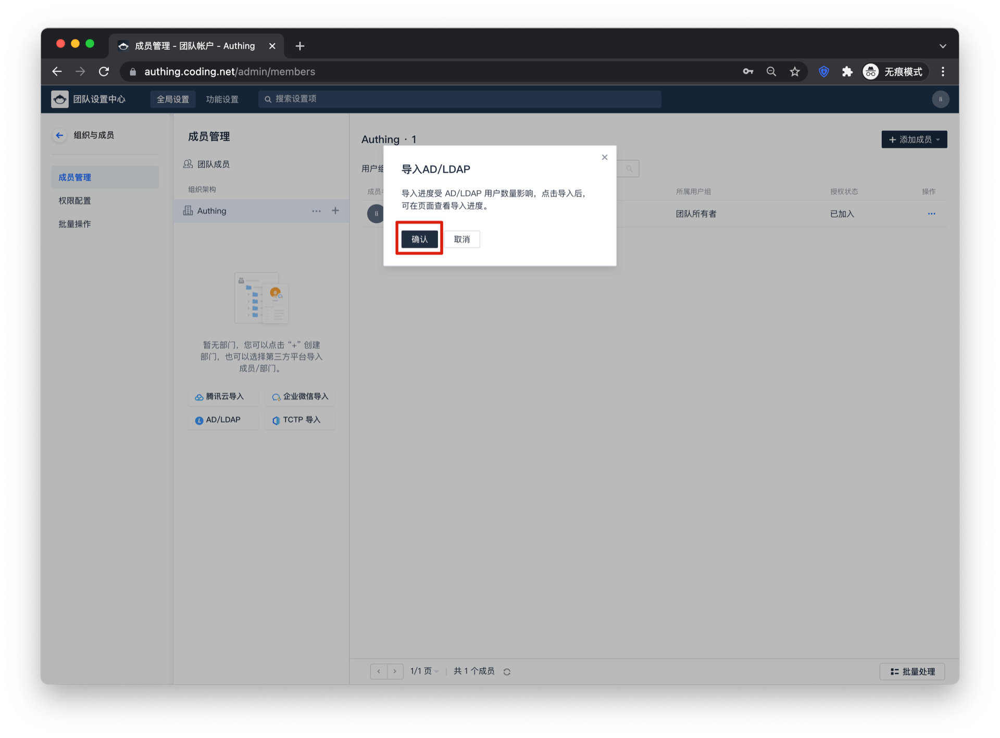

<IntegrationDetailCard :title="`导入 LDAP 用户并授权`">

点击**全局设置**，回到设置页面

点击**成员管理**

点击 **AD/LDAP**，导入 LDAP 中的用户

点击**确认**

用户导入完成后，点击**授权**，对用户进行授权

点击**确认授权**，完成对用户的授权

设置完成后，回到登录页面，点击 **AD/LDAP**，就可以使用 LDAP 中的账号密码进行登录了。用户第一次登录需要邮箱注册

</IntegrationDetailCard>