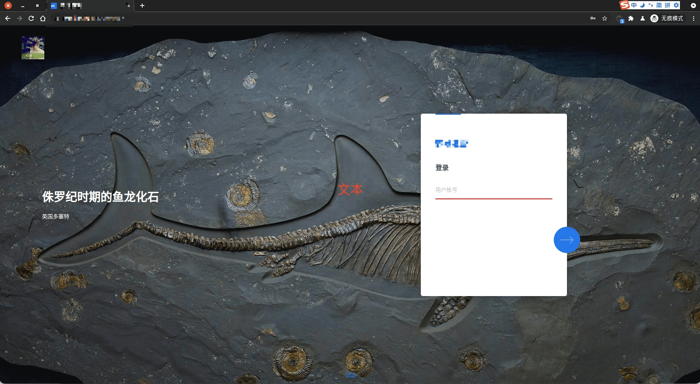
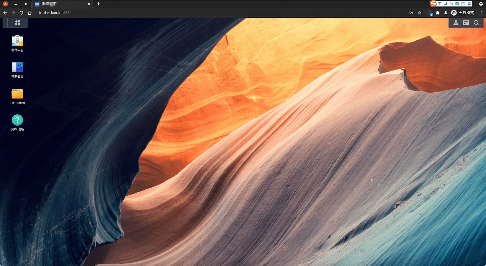
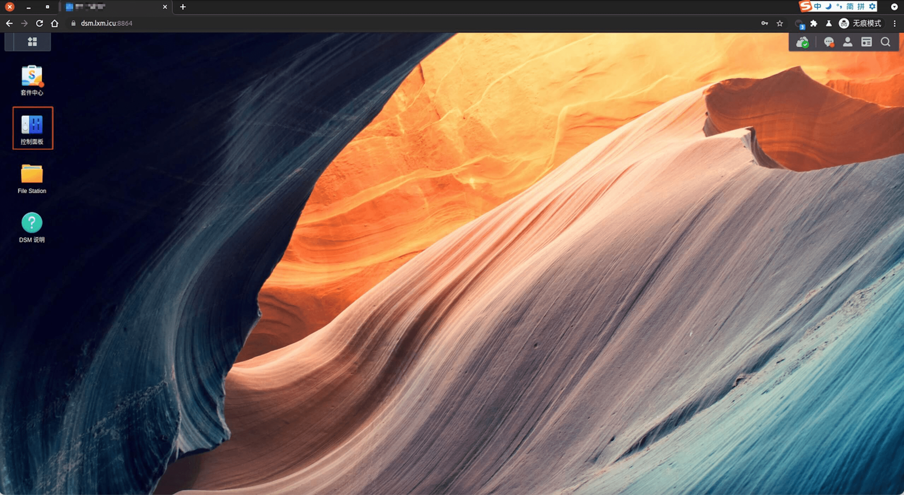
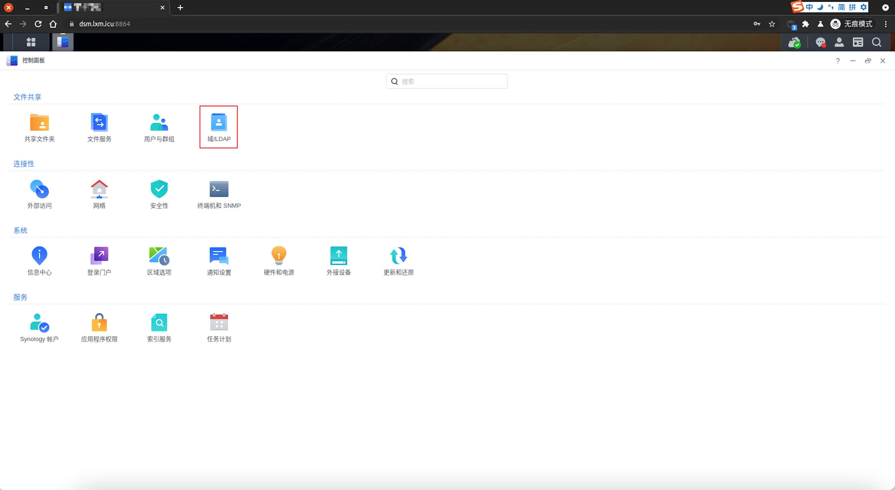
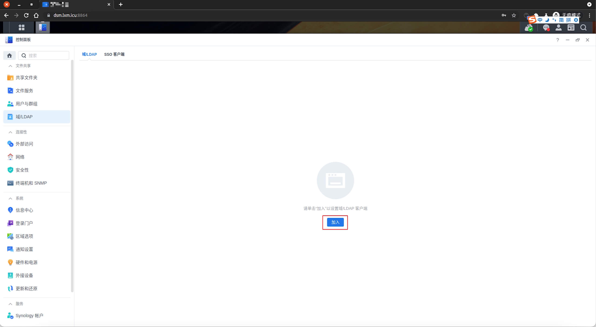
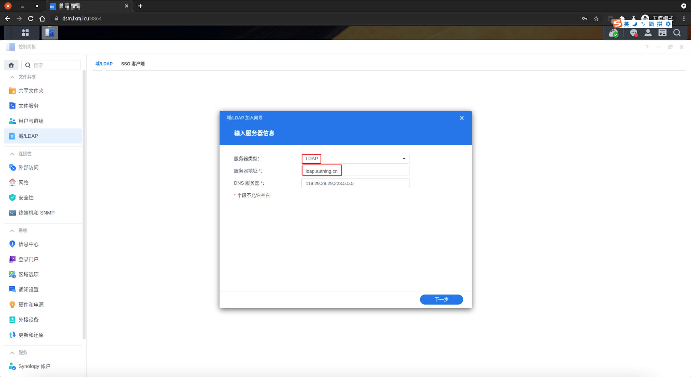
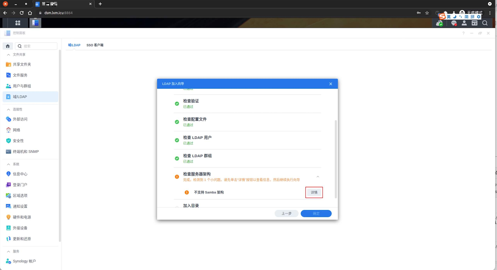
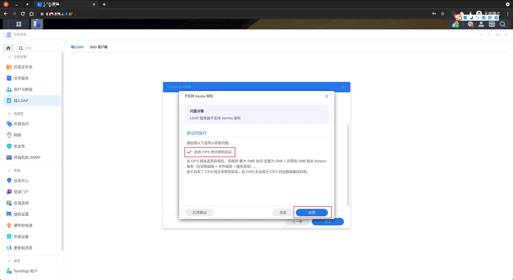
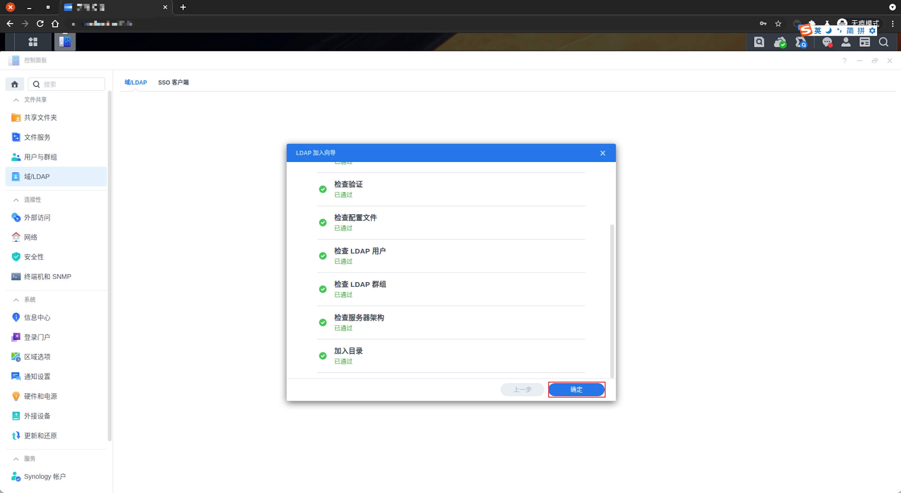

<IntegrationDetailCard :title="`在 DSM 中配置 LDAP`">

配置 DSM LDAP 登录，你需要有管理员权限。进入管理员页面。

点击 **控制面板**。

点击 **域/LDAP**。

点击 **加入**。

选择 `服务器类型` 为 **LDAP**，输入 `服务器地址`，点击 `下一步`。`服务器地址` 可以在 **{{$localeConfig.brandName}}** 控制台上查看，对应位置关注下图。

填入 `Bind DN 或 LDAP 管理员账号`，`密码`，`Base DN`。这些信息可以在 **{{$localeConfig.brandName}}** 控制台上查看，对应位置如图。 `加密` 选择 **无**，`配置文件` 默认选择 **标准**。`点击` **下一步**。

检测相关配置信息，发现 **不支持 Samba 架构**，`点击` **详情**。

点击 **启用 GIFS 明文密码验证**，之后点击 **应用**。

点击 **确认**，完成配置项保存。

配置完成之后如图。

</IntegrationDetailCard>
