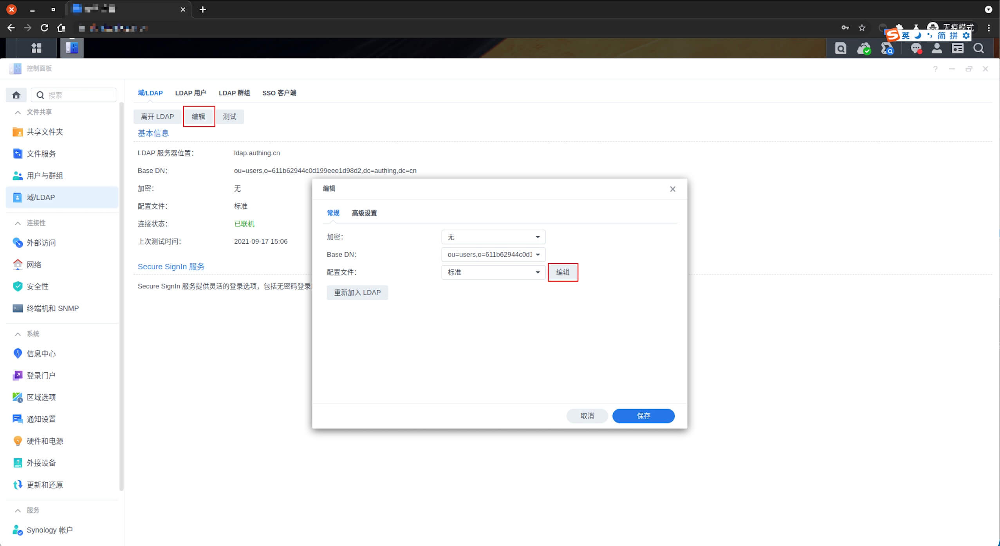
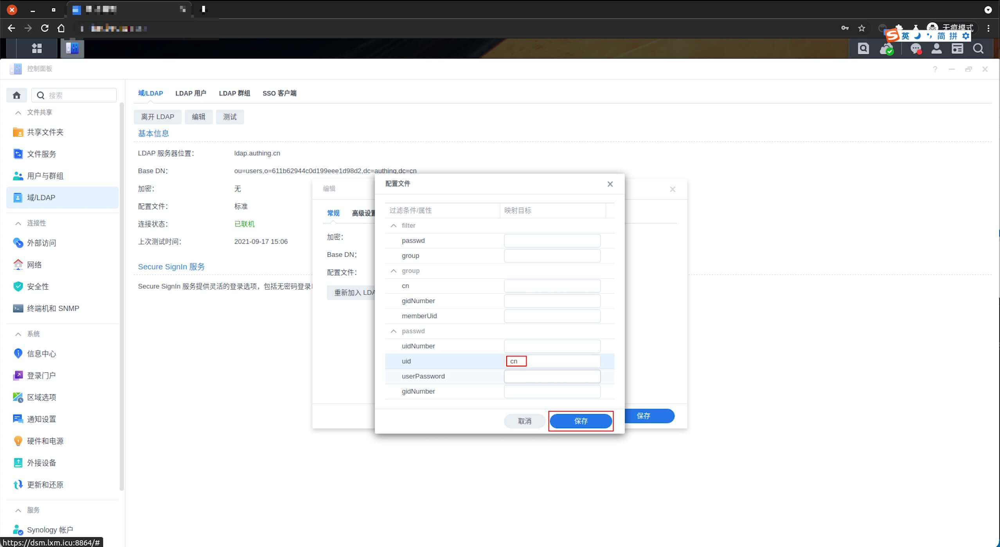
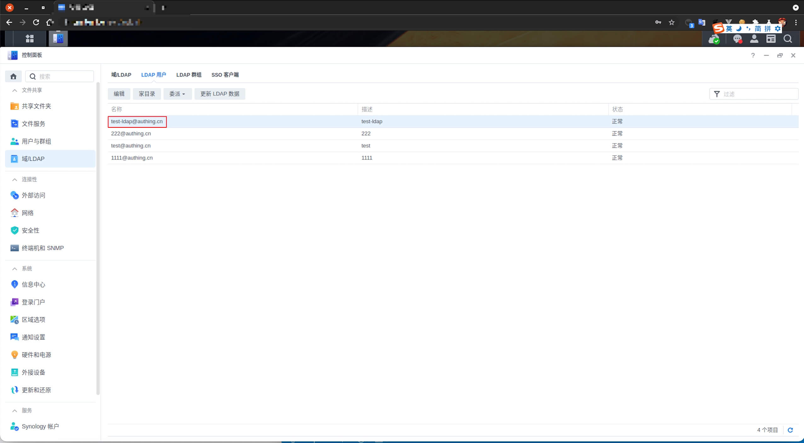
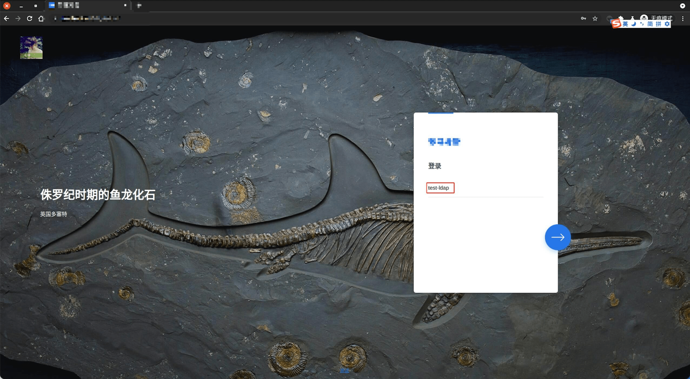
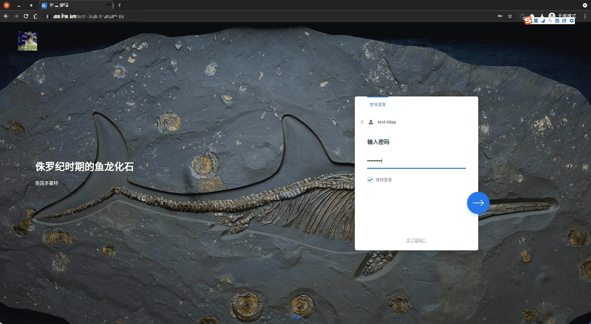
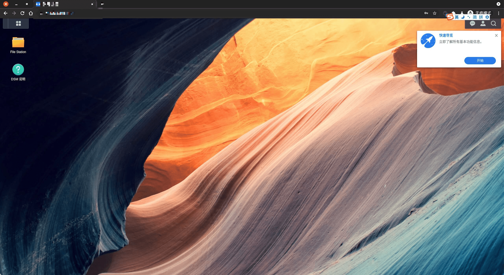
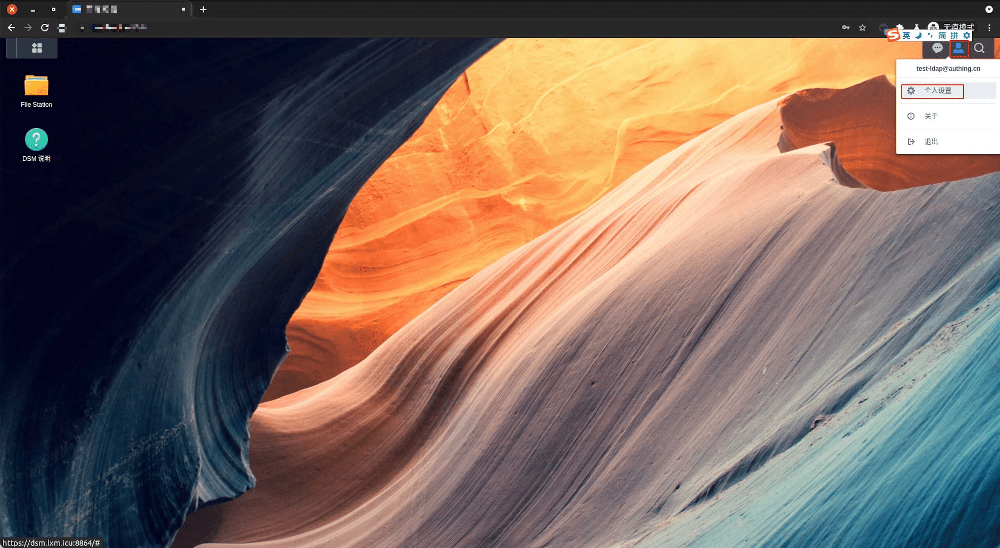
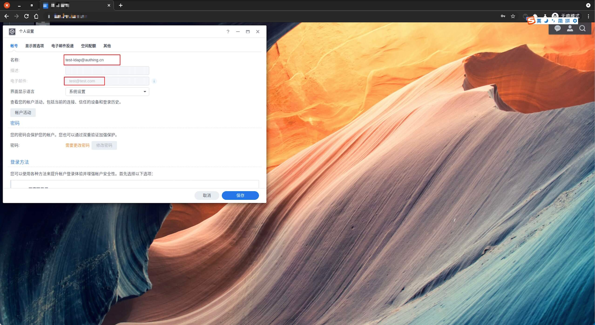

<IntegrationDetailCard :title="`使用 ${$localeConfig.brandName} 登录 DSM`">

进入 **DSM** LDAP 配置页面，点击 `LDAP 用户`。

此时呈现的为 **默认** 配置的用户信息，现在进入 `域/LDAP`，点击 **编辑**，`配置文件` 点击 **编辑**。

对应的 **password -> uid** 修改为 **cn**，点击 **保存**。

点击 **LDAP 用户**，发现对应的用户信息已经发生改变。

进入 **DSM** 登录页面，输入对应的 **测试账号信息**。

输入密码信息，**点击** 登录。

登录 **成功**，即可看到相关提示信息。

点击 `右上角用户图标 -> 个人设置`， 查看当前 **用户信息**。

查看 **当前登录用户** 相关信息。

</IntegrationDetailCard>
