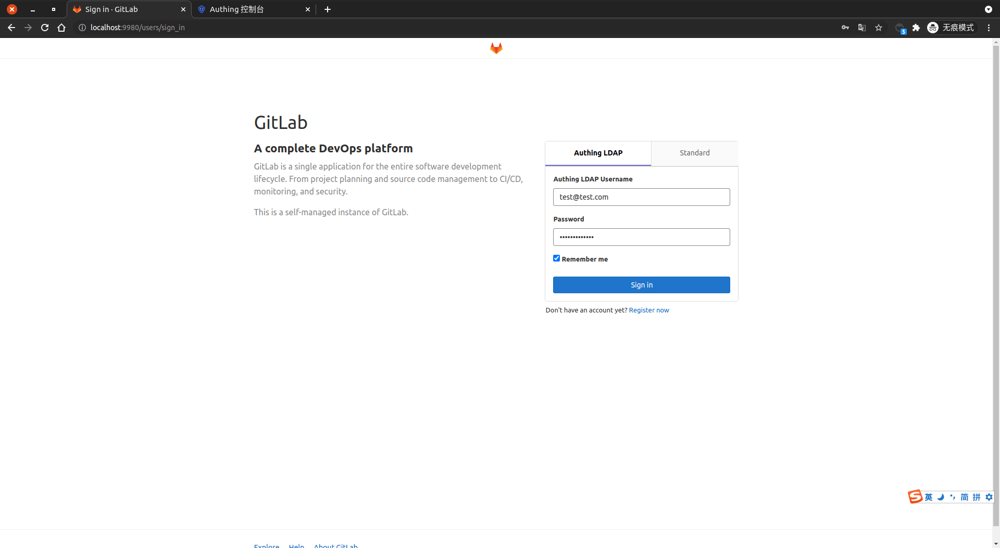
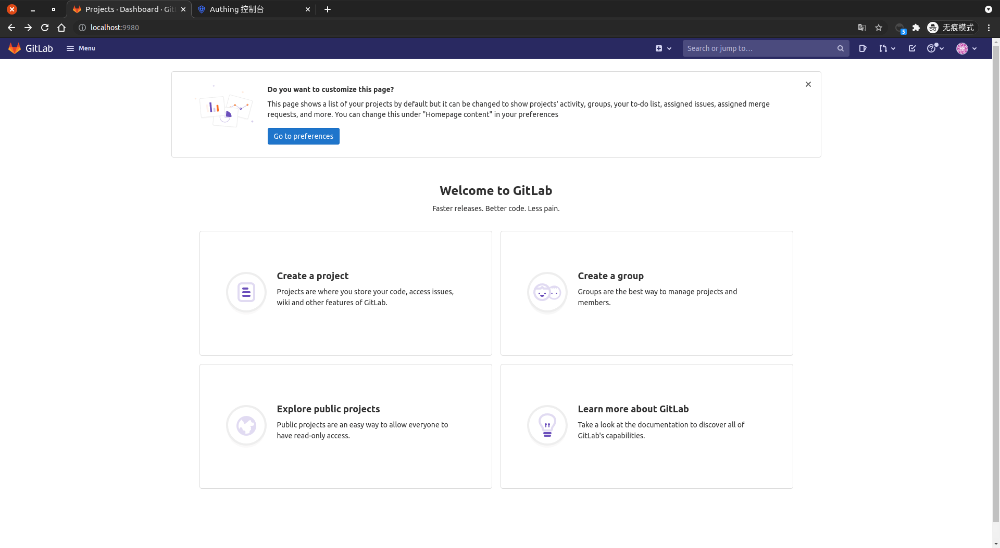
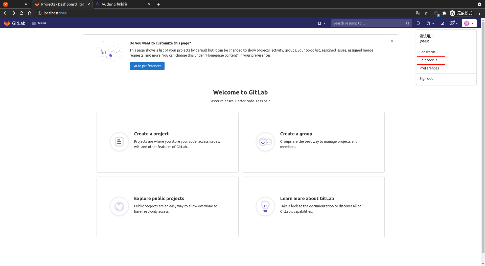

<IntegrationDetailCard :title="`使用 ${$localeConfig.brandName} 登录 GitLib`">

进入 **GitLib** 登录页面，输入对应的 **测试账密信息**，**点击** 登录。

登录 **成功**，即可看到相关提示信息。

点击 `用户头像 -> Edit profile`， 查看当前 **用户信息**。

查看 **当前登录用户** 相关信息。

</IntegrationDetailCard>
