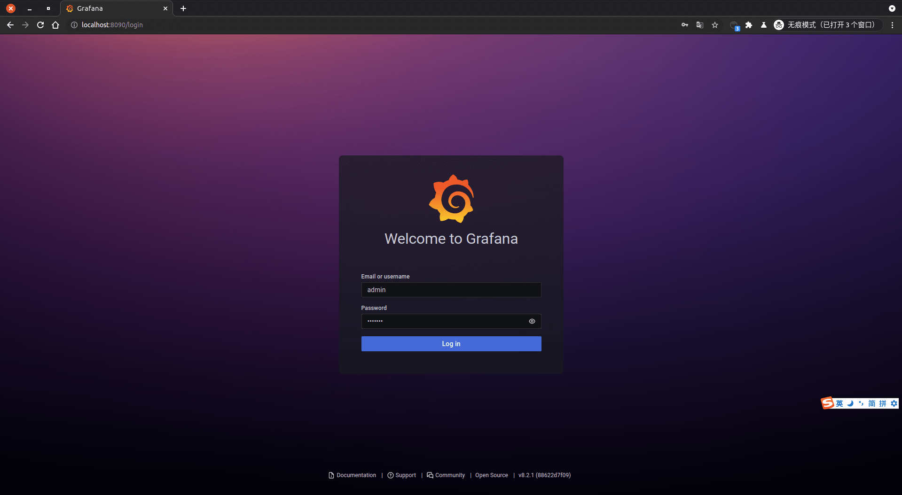
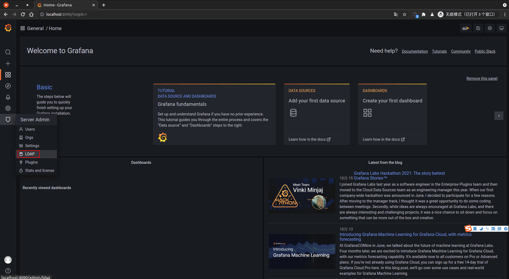
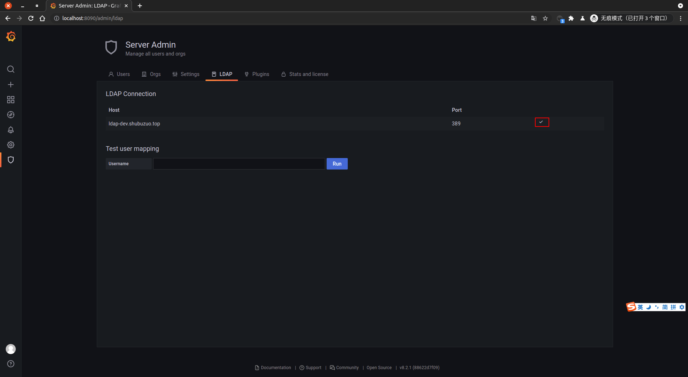
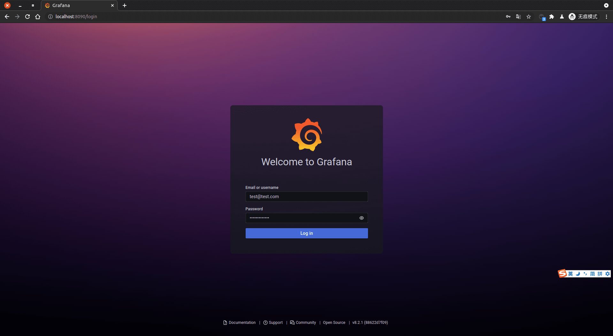
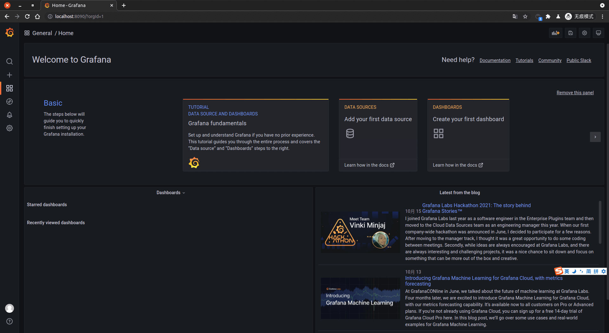
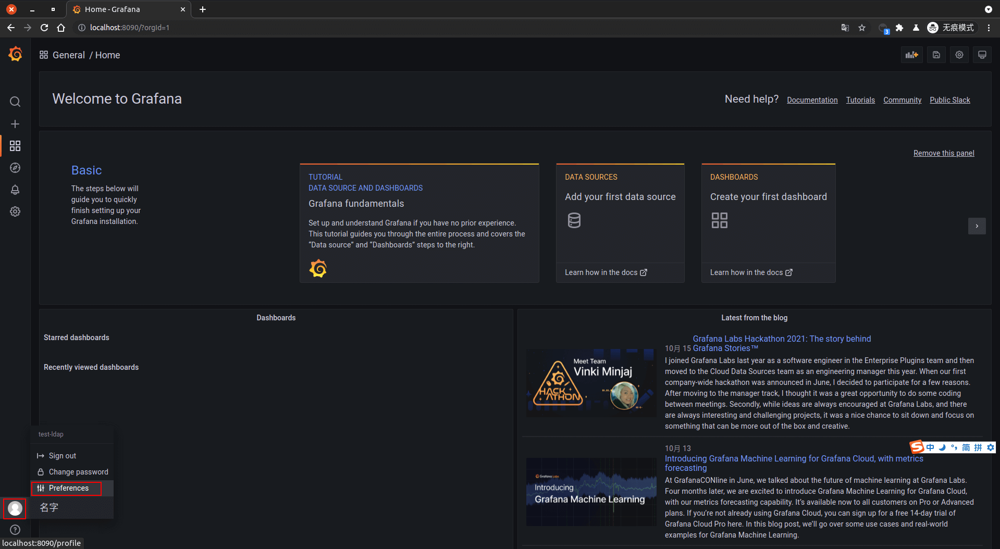
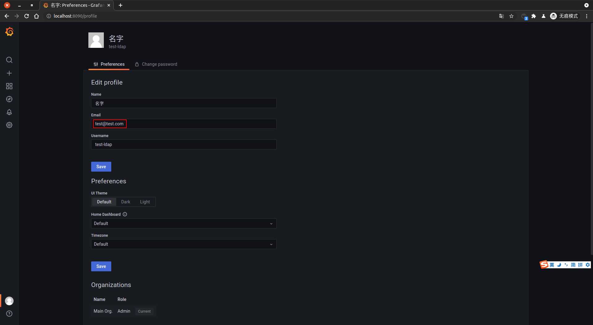

<IntegrationDetailCard :title="`使用 ${$localeConfig.brandName} 登录 Grafana`">

使用管理员登录 **Grafana**，输入对应的 **账密**，**点击** 登录。

移动到左侧 **Server Admin**，点击 **LDAP**。

查看对应的 **连接状态**，显示正常。

在 **Test user mapping** 中，填写对应的 **测试邮箱**，点击 **Run**，进行相关查询，等待查询结果，结果包含 `用户信息`，`用户所属组信息`。

管理员 **登出**，进入 **Grafana** 登录页面，输入对应的 **测试账密信息**，**点击** 登录。

登录 **成功**，即可看到相关提示信息。

点击 `用户头像 -> Preferences`， 查看当前 **用户信息**。

查看 **当前登录用户** 相关信息。

</IntegrationDetailCard>
