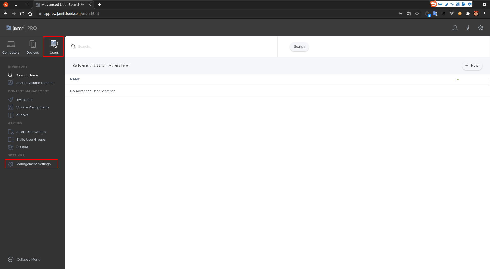
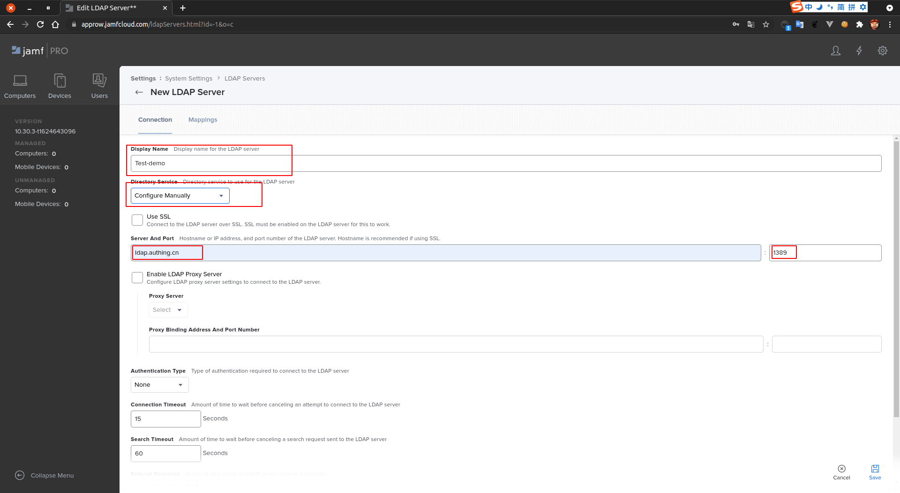
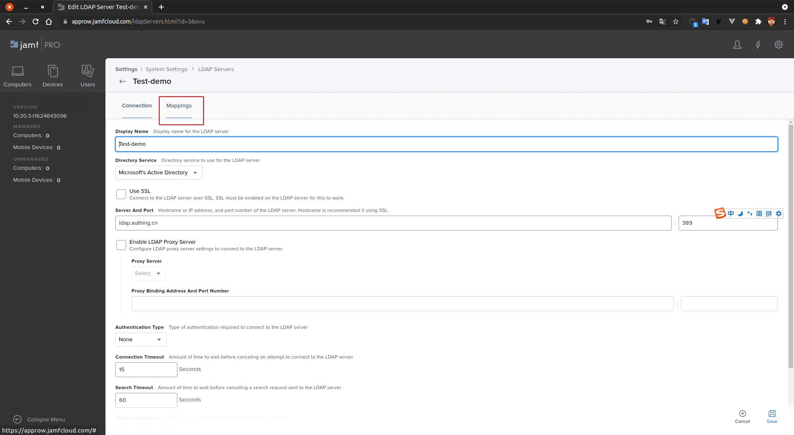
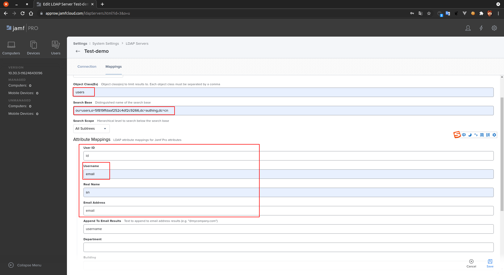
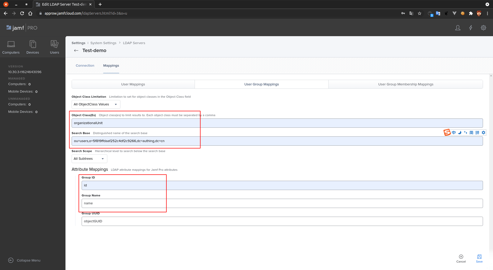

<IntegrationDetailCard :title="`在 Jamf 中配置 LDAP`">

配置 **jamfcloud LDAP** 需要管理员权限，点击 **Users**，点击 **Management Setting**。

点击 **All Settings**，点击 **LDAP Servers**。

增加一个 **LDAP Service**。

选择 **Configure Manually**。

点击 **Next**，填写 `LDAP Service` 的名字，`连接域名`。该信息可以在 `LDAP 控制台 -> 用户管理 -> LDAP -> LDAP 使用文档` 中获得，如下图所示

选择 `Authentication Type` 为 `Simple`，填写 `LDAP Server Account`，对应的信息在 `控制台` 获得（上图信息）。

点击 **Save**，完成保存

点击 **mapping**。

选择 **User Mappings**，填写相关配置。

>> `objectClass` 填写为 **users**，`BaseDN` 填写 **用户池 DN（{{$localeConfig.brandName}} 控制台 LDAP 文档部分可查）**。`属性映射` 如图填写，对于 `username` 可能用于 LDAP 登录（需要保证唯一），可以填写自己需要的字段。用户的所有字段查询可以到 `用户详情` -> `原始 JSON 数据` 查看。其他字段映射都可以自己参考填写，额外需要注意的是 {{$localeConfig.brandName}} 本身的字段映射，在 {{$localeConfig.brandName}} 控制台 LDAP 配置部分。

选择 **User Group Mappings**，填写相关配置。

>> `objectClass` 填写为 **organizationalUnit**，`BaseDN` 填写 **用户池 DN（Authing 控制台 LDAP 文档部分可查）**。`属性映射` 如图填写。对于 `组织单元的详细信息` 可以在 {{$localeConfig.brandName}} 控制台查看。另外 {{$localeConfig.brandName}} 身份资源中还有 **group** 相关概念，该 `objectClass` 是否应该与 group 保持一致也是需要思考的。此处暂定为 `organizationalUnit`。

选择 **User Group Membership Mapping**，填写相关配置。

>> `Member User Mapping` 为 **member**，勾选 `Use distinguished name of member user when searching the LDAP directory`。

点击 **test**，默认进入 **User Mappings** 测试。

</IntegrationDetailCard>
