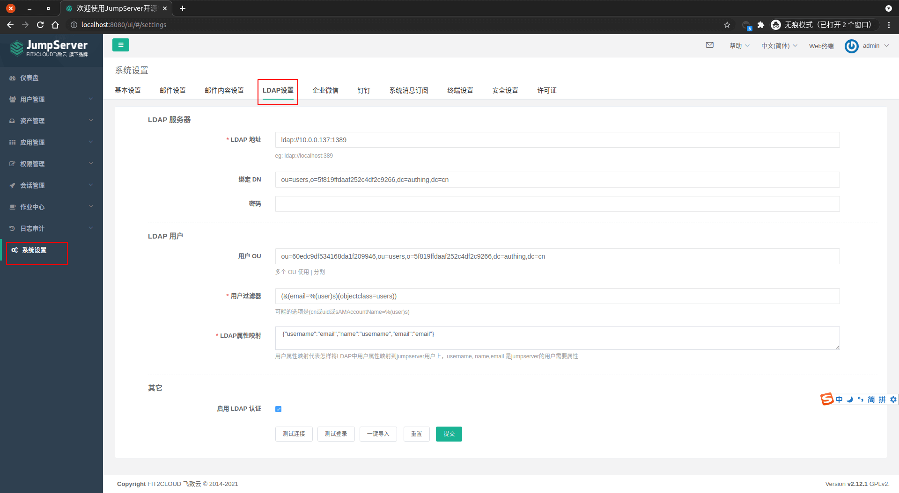
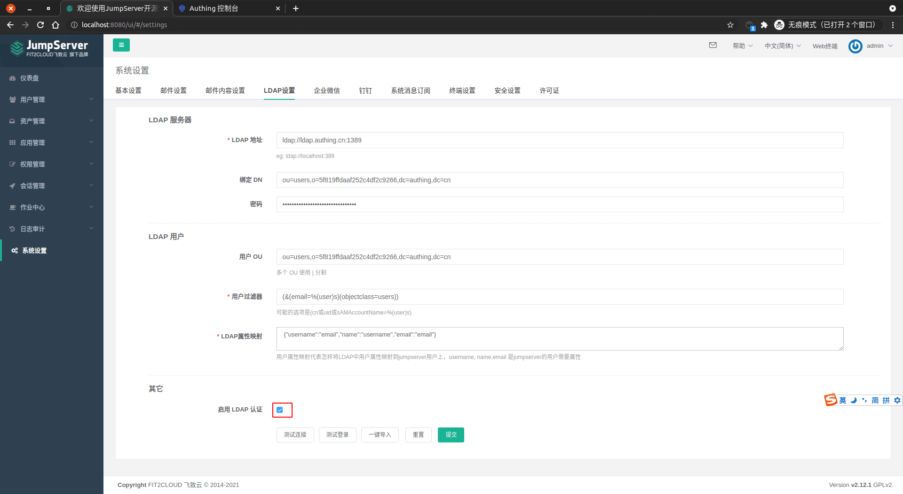
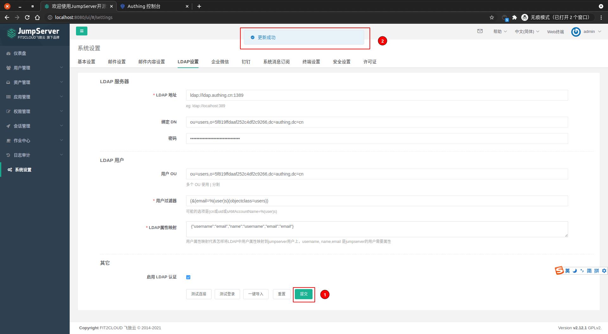
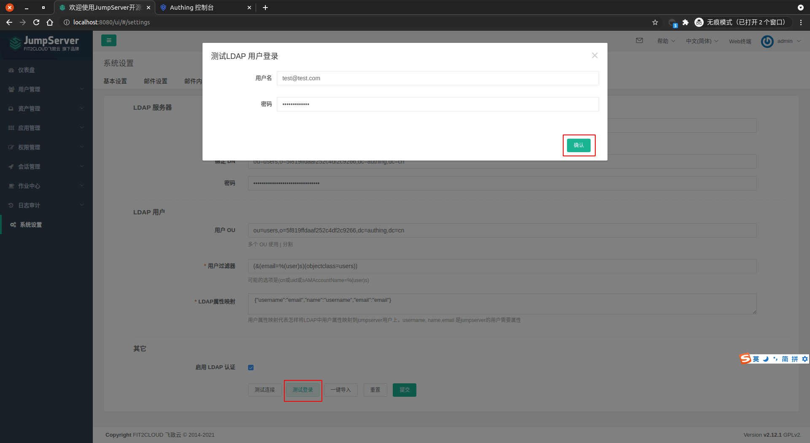

<IntegrationDetailCard :title="`在 JumpServer 中配置 LDAP`">

配置 JumpServer LDAP 登录，你需要有管理员权限。进入 **JumpServer**，点击左侧导航栏 **系统设置**，点击 **LDAP 设置**。

填写对应的 **LDAP 配置信息**， 其中 `LDAP 地址`、`绑定 DN`、`用户 OU` 信息可以在 **{{$localeConfig.brandName}}** 控制台上查看，对应位置如图。 `密码` 则为 **{{$localeConfig.brandName}}** 控制台 `设置 -> 用户池秘钥`。 `用户过滤器` 可以填写为 `(&(email=%(user)s)(objectclass=users))`， `LDAP 属性映射` 可以填写为 `{"username":"email","name":"username","email":"email"}`。

启用 **LDAP 身份认证**。

点击 **测试连接**。

**提交** LDAP 设置， 以 **测试登录**。

测试登录。

查看认证结果。

</IntegrationDetailCard>
