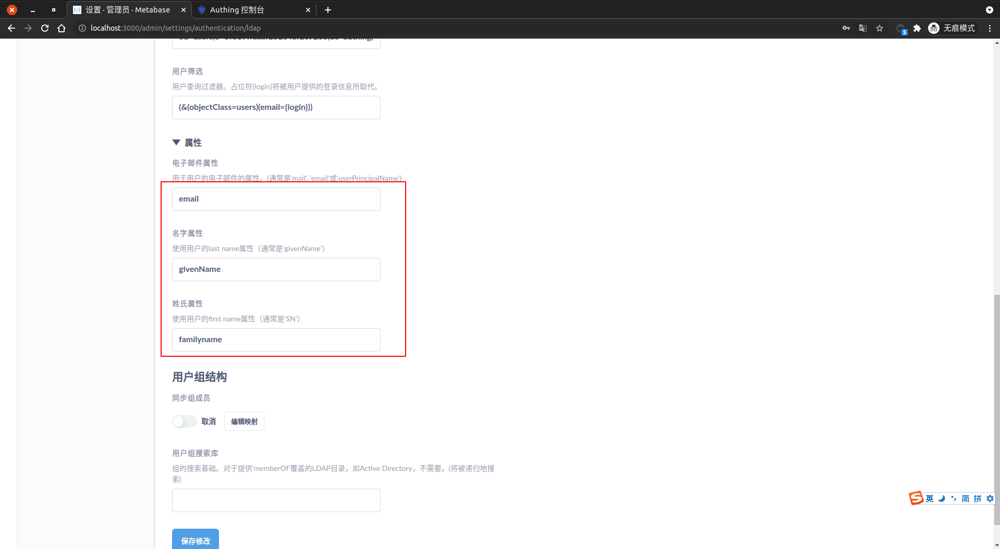

<IntegrationDetailCard :title="`在 Metabase 中配置 LDAP`">

配置 Metabase LDAP 登录，你需要有管理员权限。进入 **Metabase**，点击右上角 **设置** 图标，点击 **管理员**， 进入管理员页面。

点击 **认证**， 选择 **LDAP**，点击 **配置**。

进入 **服务器设置**，点击生效 **LDAP 身份认证**。

填入 `服务器主机名`，`LDAP 端口`，`用户名或 DN`，`用户搜索库`， `用户筛选`。其中 `服务器主机名`、`LDAP 端口`、`用户名或 DN`、`用户搜索库` 信息可以在 **{{$localeConfig.brandName}}** 控制台上查看，对应位置如图。
`用户筛选` 填写为 **(&(objectClass=users)(email={login}))**，可以根据自己需求自定义 `filter`。

填写相关 **属性**，可以根据自己需求自定义相关属性映射。

点击 **保存修改** 完成配置保存。

</IntegrationDetailCard>
