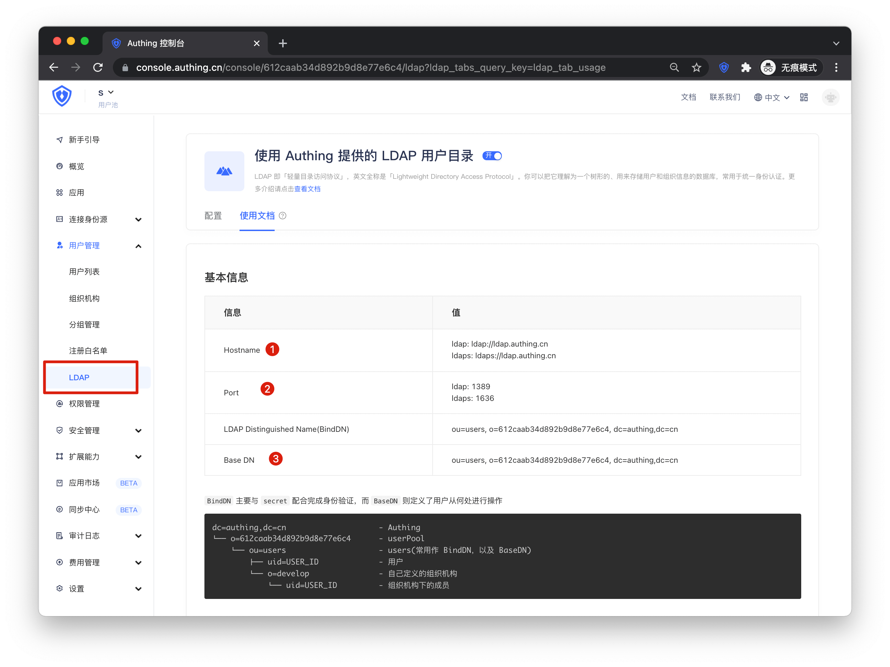
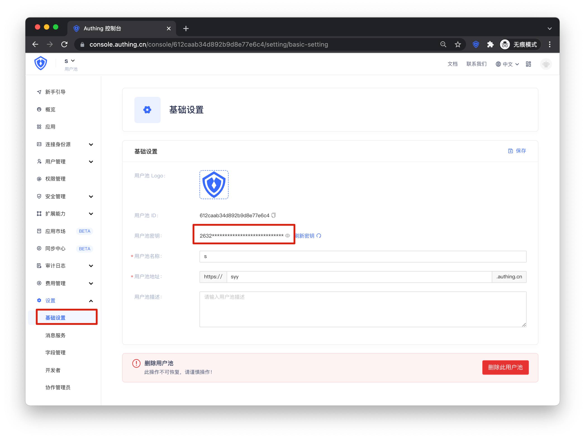

<IntegrationDetailCard :title="`从 ${$localeConfig.brandName} 中获取 LDAP 配置信息`">

进入 **{{$localeConfig.brandName}}** 控制台，进入 `用户管理 -> LDAP -> 使用文档` 
1. 复制 `ldap.authing.cn`
2. 使用 ldap 复制 **1389**，使用 ldaps 复制 **1636**
3. 复制 **Base DN**

进入 `设置 -> 基础设置`，复制 **用户池密钥**

</IntegrationDetailCard>
