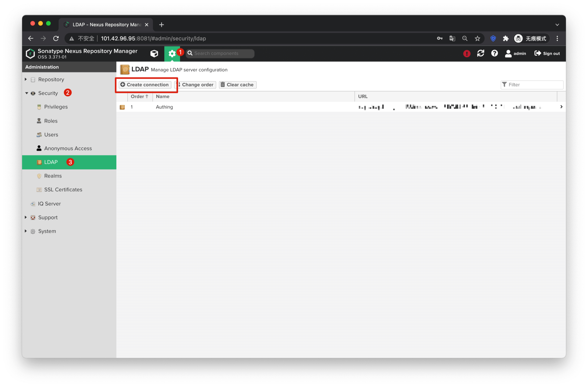
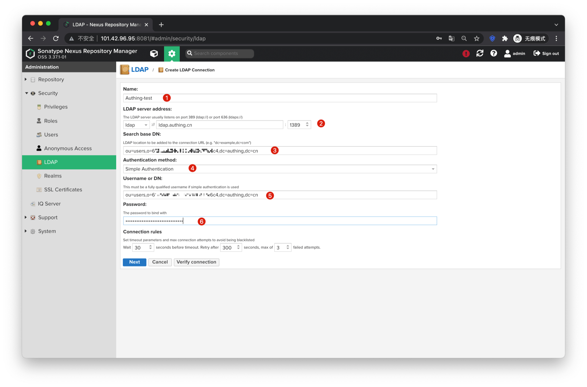

<IntegrationDetailCard :title="`在 Nexus 中配置 LDAP`">

管理员账号登录私有化部署的 Nexus 服务，进入 `设置 -> Security -> LDAP`，点击 **create connection**

1. Name：随意填写，没有特殊要求
2. 上一步复制的内容，根据自己的需求选择
    1. ldap://ldap.authing.cn:1389
    2. ldaps://ldap.authing.cn:1636
3. Search base DN：上一步复制的 Base DN，注意把 “,” 后面的空格去掉
4. Authentication Method：Simple Authentication
5. Username or DN：上一步复制的 Base DN，注意把 “,” 后面的空格去掉
6. Password：上一步复制的应用池密钥

点击 **Verify connection** 以验证连接，出现右上角绿色提示说明配置正确

点击 **User and group**
1. Object class：posixAccount
2. User ID attribute：email；想要使用用户在 {{$localeConfig.brandName}} 中的 username 作为用户在 Nexus 的唯一标识的话，此处填写 cn
3. Real name attribute：cn
4. Email attribute：email
5. Group type：Dynamic Groups
6. Group member of attribute：group

1. 点击 **Verify user mapping**
2. 展示 {{$localeConfig.brandName}} 中的用户列表
3. 出现如图绿色提示说明配置正确

点击 create，保存 LDAP 配置。此时就可以用 {{$localeConfig.brandName}} 中的账号密码登录 Nexus 了。

</IntegrationDetailCard>
