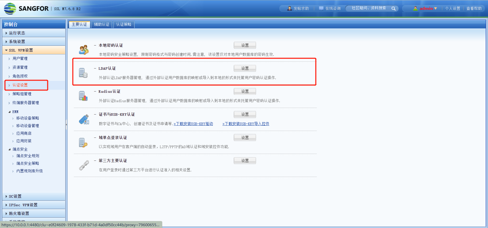
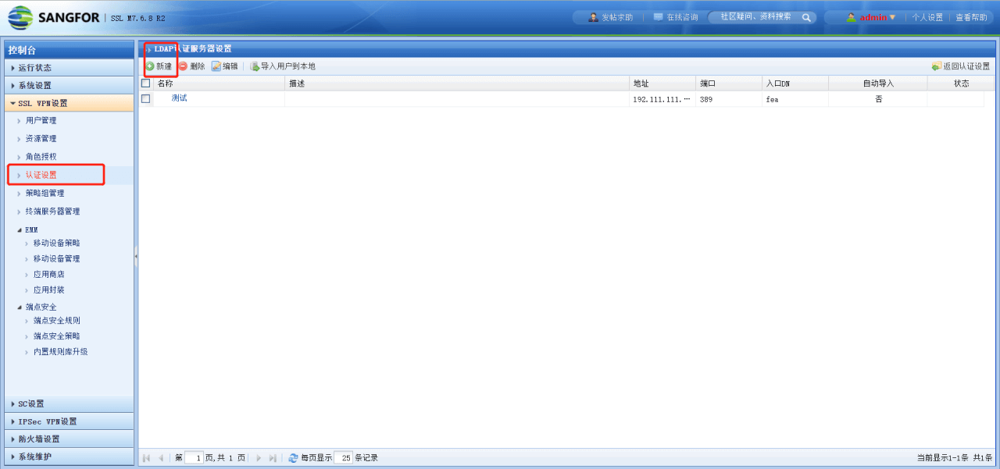
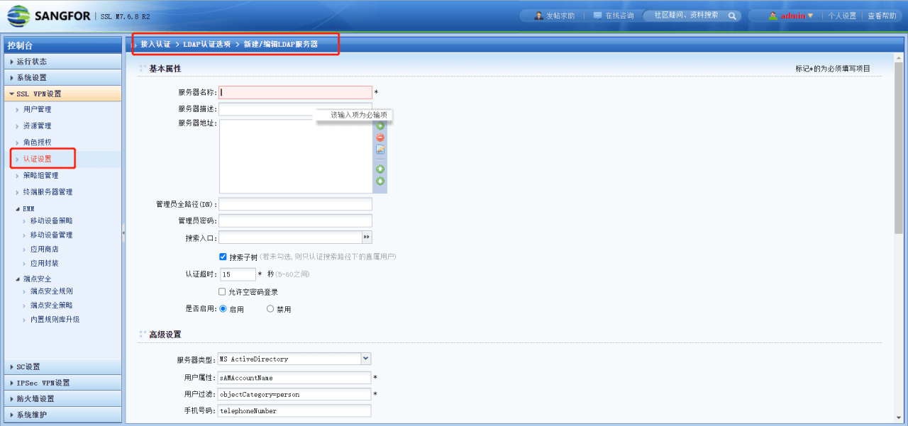
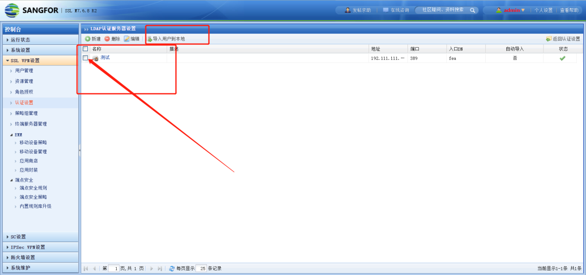
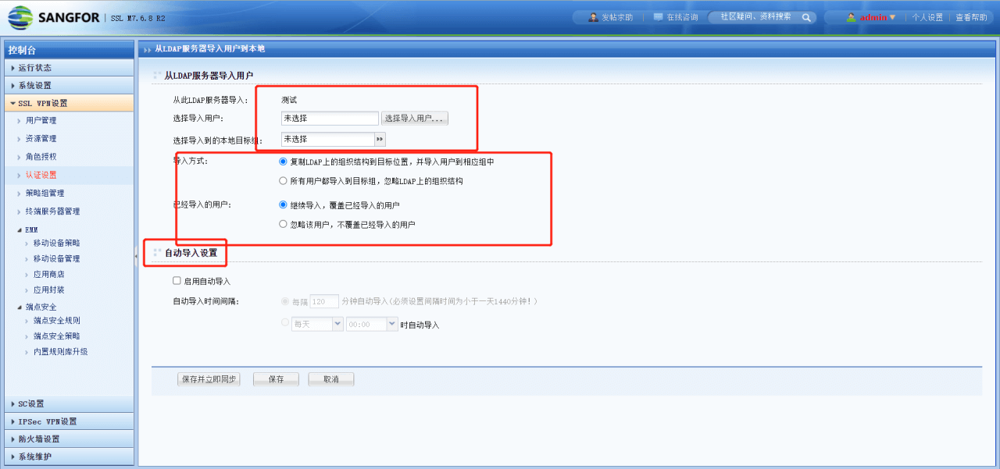

<IntegrationDetailCard :title="`从 ${$localeConfig.brandName} 中获取 LDAP 配置信息`">

- 管理员账号登录深信服控制台，点击**认证设置**，选择 LDAP 认证，点击设置按钮

- 点击**新建**

- 服务器名称：可以随意填写（中英文都可以）。
- 服务器地址：上一步获取的${HostName}：${Port},例：ldap.authing.cn:1389
- 管理员全路径（DN）：上一步获取的**Base DN**
- 管理员密码：上一步获取的**用户池密钥**
- 搜索入口：上一步获取的**Base DN**
- 认证超时：默认
- 是否启用：选择是。
- 高级设置：服务类型 ：ldap server
  - 用户属性 ：cn
  - 用户过滤： objectclass=person
  - 手机号码： phone

- 选择导入用户到本地，选择刚创建的 LDAP 服务器。
  - 注：同步用户时需要在 authing 中为用户添加部门

- 如图进行配置

点击最下方按钮：保存并立即同步，完成配置。

</IntegrationDetailCard>
