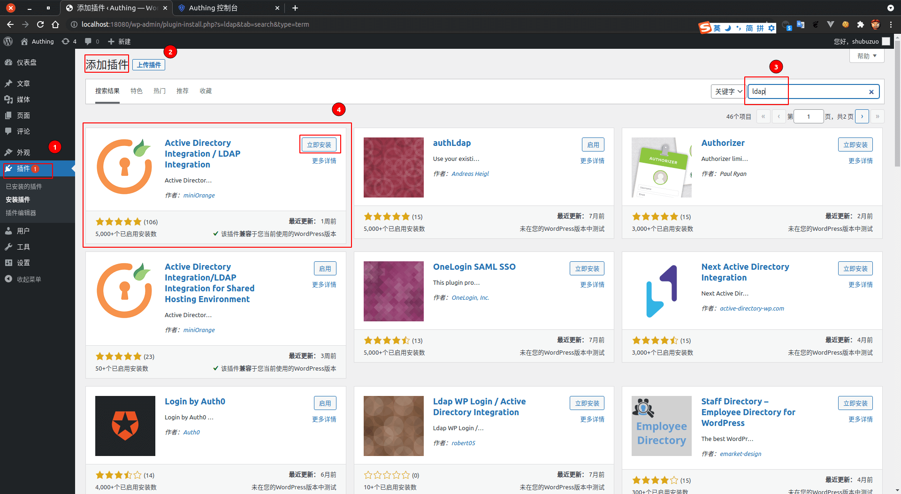
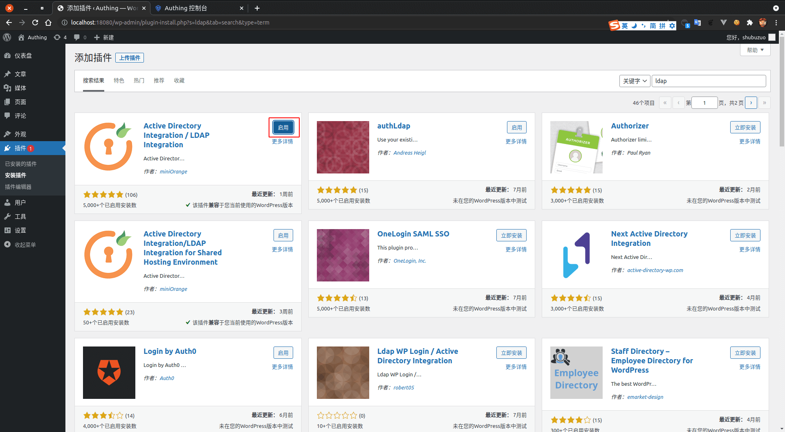
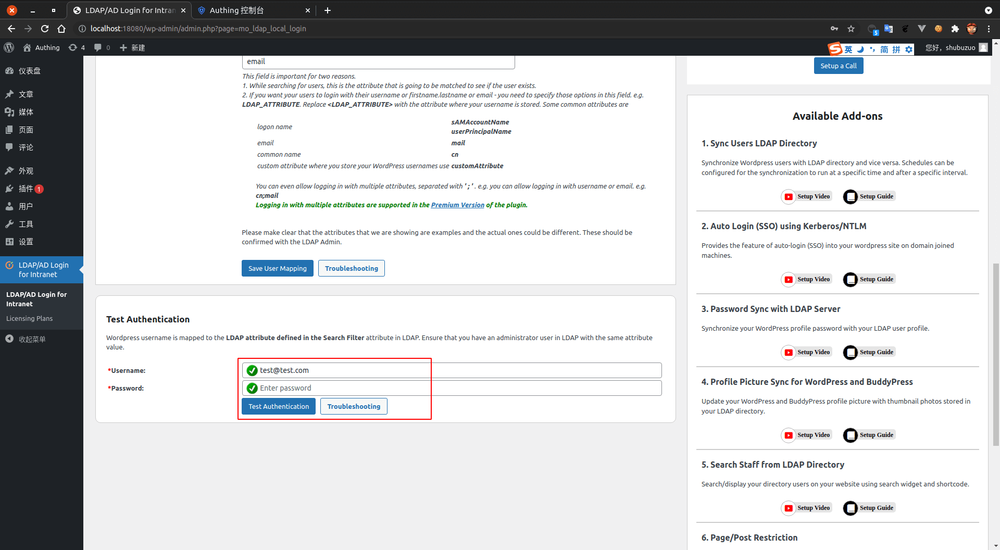
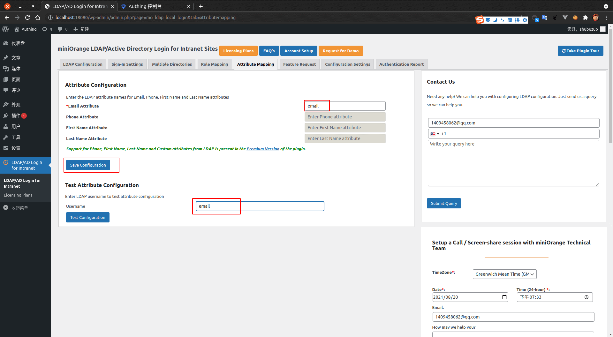

<IntegrationDetailCard :title="`在 Wordpress 中配置 LDAP`">

配置 Wordpress LDAP 登录，你需要有管理员权限。进入 **Wordpress**， 进入管理员页面。点击 `插件 -> 添加插件 -> 搜索`， 输入 **LDAP** 关键字， 选择 **如图插件**， 点击 **立即安装**。

点击 **启用**。

点击左侧导航栏 **LDAP/AD Login for intranet**，进入 **LDAP Configuration**。`Directory Server` 选择 **other**。填写对应的相关信息， 其中 `LDAP server`、`username（对应为控制台 LDAP BindDN）` 信息可以在 **{{$localeConfig.brandName}}** 控制台上查看，对应位置如图。 `Password` 则为 **{{$localeConfig.brandName}}** 控制台 `设置 -> 用户池秘钥`。 之后点击 **Test Connection & Save**。

填入 `Search Base`（对应于 BaseDN），`Username Attribute`。点击 **Save User Mapping**。

填写测试 **账号密码**，点击 **Test Authentication**。

进入 **Sign-in Settings** 允许 LDAP Login。

进入 **Attribute Mapping** 填写相关配置项并保存。这里使用 `email` 作为主要的映射字段。填写之后 **Save**。

</IntegrationDetailCard>
