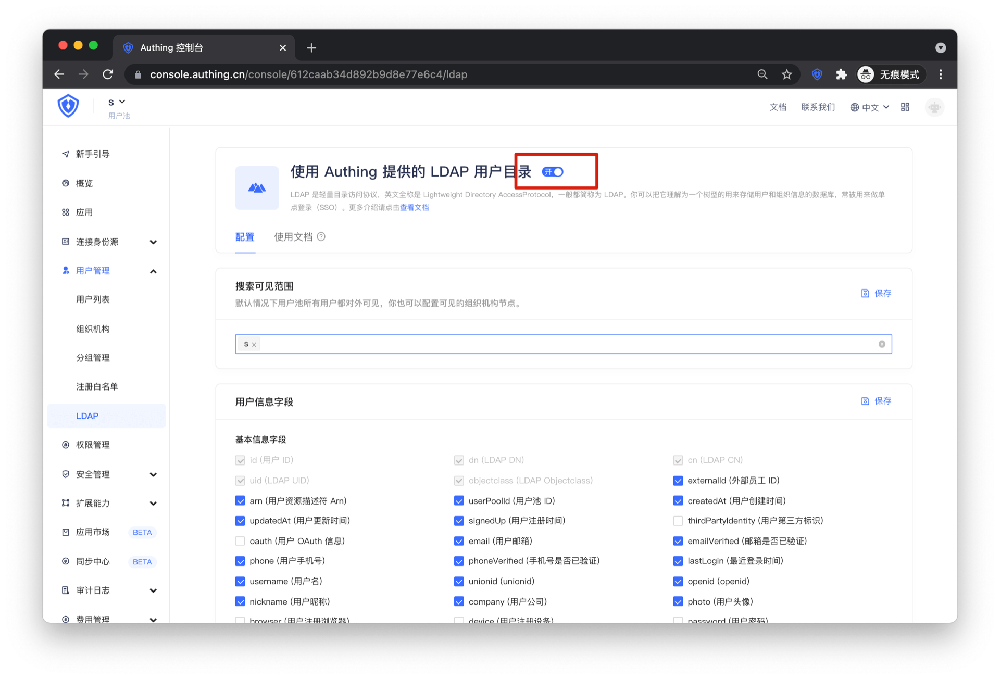
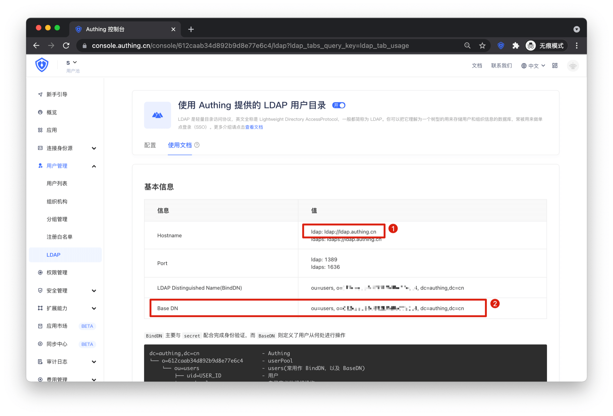
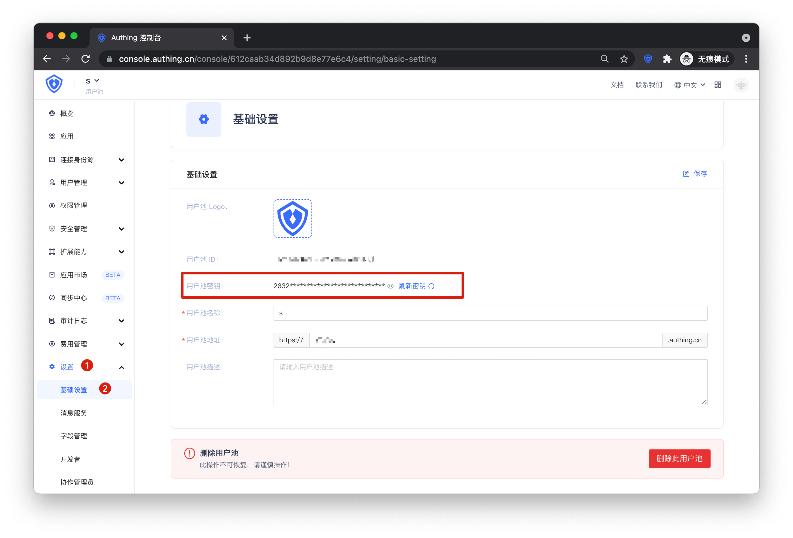

<IntegrationDetailCard :title="`从 ${$localeConfig.brandName} 中获取 LDAP 配置信息`">

进入 **{{$localeConfig.brandName}}** 控制台，进入 `用户管理 -> LDAP` ，打开顶部的按钮

点击使用文档
1. Hostname：YAPI LDAP 配置中 server 的值
2. Base DN：YAPI LDAP 配置中 baseDn 和 searchDn 的值

进入 `设置 -> 基础设置`，复制用户池密钥，YAPI LDAP 配置中 bindPassword 的值

</IntegrationDetailCard>
