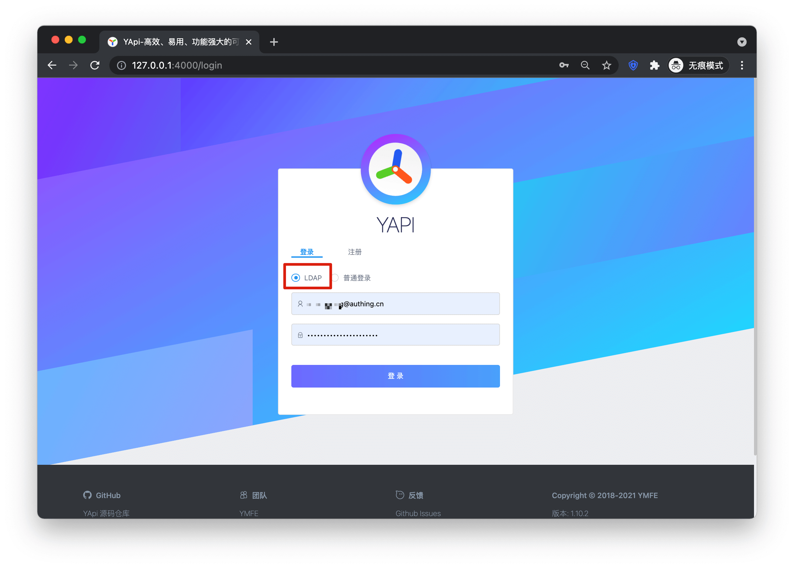

<IntegrationDetailCard :title="`使用 ${$localeConfig.brandName} 用户登录 YAPI`">

- 重启服务器后，可以在登录页看到 LDAP 选项，说明 ladp 配置成功
- 使用 {{$localeConfig.brandName}} 中已有的用户登录 YAPI
- 在 YAPI 中不存在的用户第一次登录会自动创建用户

</IntegrationDetailCard>