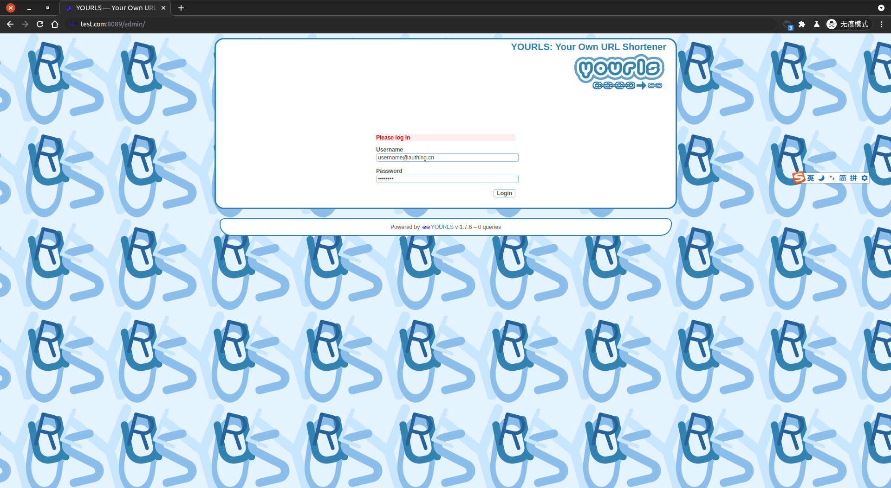
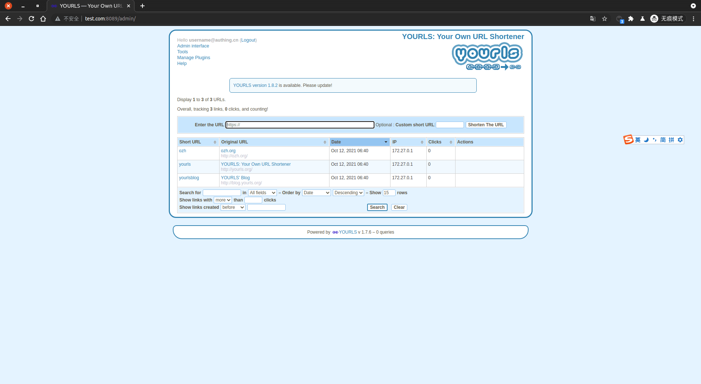

<IntegrationDetailCard :title="`在 Yourls 中配置 LDAP`">

假定 **Yourls** 运行环境在 **docker** 中， 部署在 **系统** 中的操作基本一致。这里以 **docker** 环境为演示。
进入 **Yourls** 中。需要先安装 [Yourls LDAP 插件](https://github.com/k3a/yourls-ldap-plugin)，注意需要安装 PHP LDAP 插件。

```bash
# 找到 Yourls 容器
docker ps | grep yourls
# 6a83a3ffa9c7   yourls:1.7.6    "docker-entrypoint.s…"   40 minutes ago   Up 9 minutes   0.0.0.0:8089->80/tcp, :::8089->80/tcp     yourls_yourls_1

# 进入容器中
docker exec -it 6a83a3ffa9c7 /bin/bash
vi user/config.php
```

**追加** 如下配置。其中 `LDAPAUTH_HOST`、`LDAPAUTH_PORT`、`LDAPAUTH_SEARCH_USER`、`LDAPAUTH_BASE` 信息可以在 **{{$localeConfig.brandName}}** 控制台上查看，对应位置如图。 `LDAPAUTH_SEARCH_PASS` 则为 **{{$localeConfig.brandName}}** 控制台 `设置 -> 用户池秘钥`。需要注意的是 Yourls 的 LDAP 端口属性并不会生效，即使配置了其他端口，依旧会请求 389 端口。

```php
/*
 ** Personal settings would go after here.
 */
define( 'LDAPAUTH_HOST', 'ldap://ldap.authing.cn' ); // LDAP服务地址 => 控制台 -> 用户管理 -> LDAP -> 使用文档 Hostname
define( 'LDAPAUTH_PORT', '389' ); // 此配置项不可缺少，配置其他的数值不会生效，只会请求 389 端口
define( 'LDAPAUTH_BASE', 'ou=users,o=611b62944c0d199eee1d98a2,dc=authing,dc=cn' ); // 查询 BaseDN => 控制台 -> 用户管理 -> LDAP -> 使用文档 BaseDN
define( 'LDAPAUTH_USERNAME_FIELD', 'email'); // 设置该属性，则用户登录输入的用户名也应该为该属性，同时对应于之后的 LDAPAUTH_SEARCH_FILTER
define( 'LDAPAUTH_SEARCH_USER', 'ou=users,o=611b62944c0d199eee1d98a2,dc=authing,dc=cn' ); // BindDN => 控制台 -> 用户管理 -> LDAP -> 使用文档 BaseDN
define( 'LDAPAUTH_SEARCH_PASS', '25b34fe6cf1f66b0cf61e5464cf76f31'); // 同步用户信息的账户密码 => 控制台 -> 设置 -> 用户池秘钥
define( 'LDAPAUTH_SEARCH_FILTER', '(&(email=%s)(objectclass=posixAccount))' ); // 查询模板
```

对应 {{$localeConfig.brandName}} 相关配置。


重启 **Yourls**，使其配置生效。

以管理员账户登录 Yourls。





进入插件页面，之后启用 LDAP 认证插件。


</IntegrationDetailCard>
