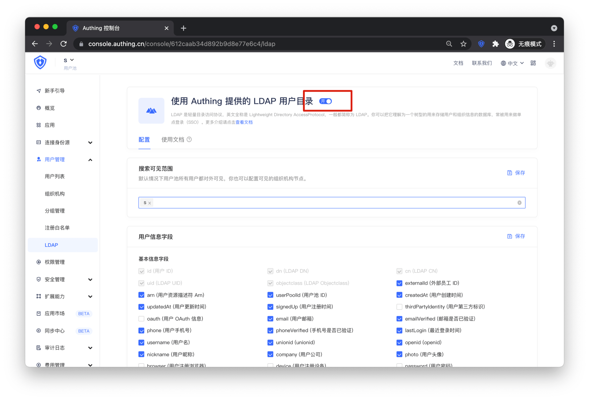
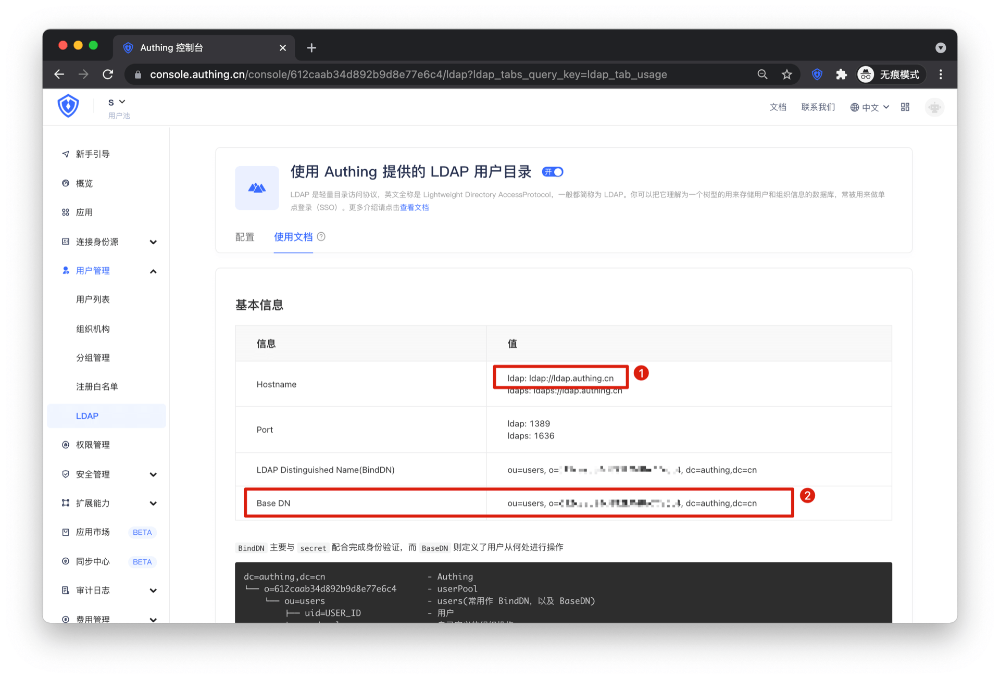

<IntegrationDetailCard :title="`从 ${$localeConfig.brandName} 中获取 LDAP 配置信息`">

进入 **{{$localeConfig.brandName}}** 控制台，进入 `用户管理 -> LDAP` ，打开顶部的按钮

点击使用文档
1. Hostname：Zeppelin LDAP 配置中 `ldapRealm.contextFactory.url` 的值
2. Base DN 对应 Zeppelin 中的以下配置
    - ldapRealm.contextFactory.environment[ldap.searchBase]
    - ldapRealm.userDnTemplate = cn={0}, ${Base DN}
    - ldapRealm.contextFactory.systemUsername
    - ldapRealm.searchBase

进入 `设置 -> 基础设置`，复制用户池密钥，Zeppelin LDAP 配置中 `ldapRealm.contextFactory.systemPassword` 的值

重启服务，即可使用 LDAP 中的用户登录 Zeppelin。

</IntegrationDetailCard>