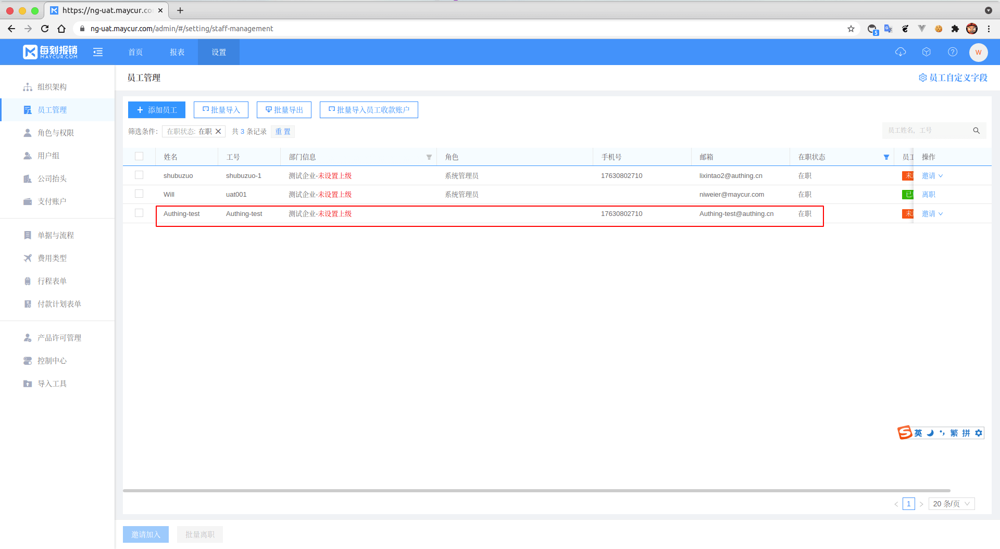

<IntegrationDetailCard :title="`在每刻报销中创建用户`">

进入 **每刻报销** 管理界面，点击 `设置` -> `员工管理` -> `添加用户`，在 **每刻报销** 中创建一个用户，此处的 **用户邮箱**，**工号**，**手机号** 需要注意，这对应着你在上步中选择的 **登录属性**(此处依旧以 **邮箱** 为例)。

点击 **保存**，成功创建用户。

</IntegrationDetailCard>
