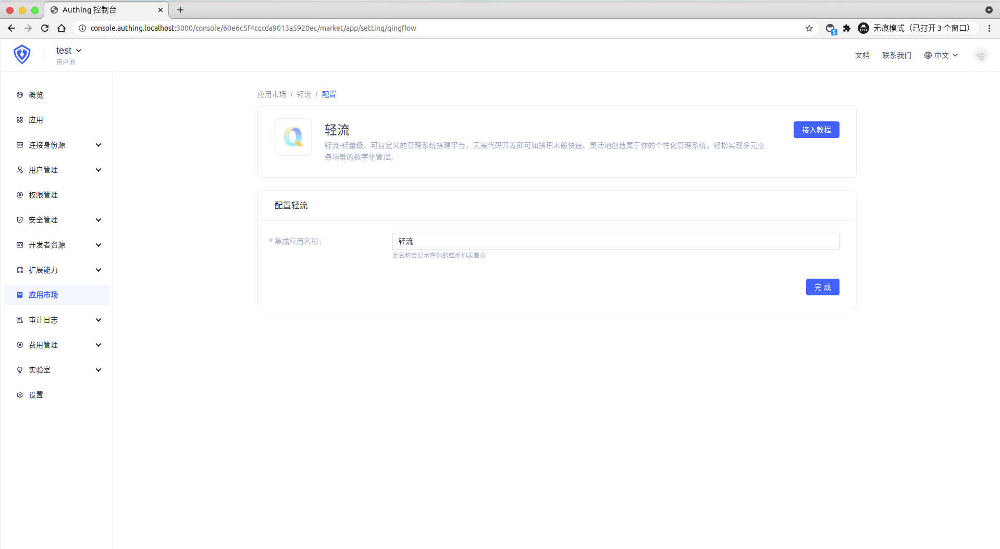
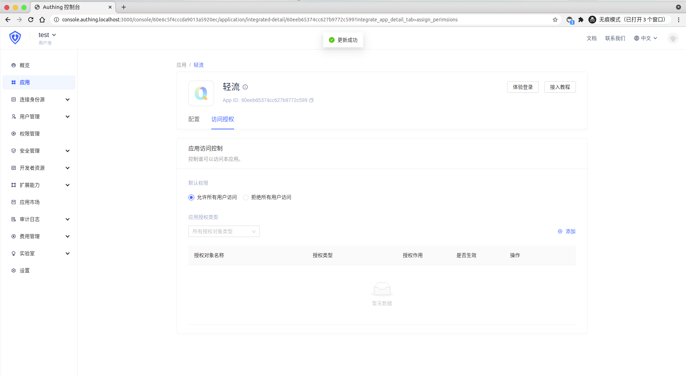

<IntegrationDetailCard :title="`在 ${$localeConfig.brandName} 中创建应用`">

进入[**控制台**](https://console.authing.cn) > **单点登录 SSO** > **添加应用** ，找到**轻流**，点击进入详情，然后点击获取应用。

输入应用名称，点击下一步。

填写 **轻流 SSO 配置** 中的 `轻流域名`（私有化部署需要填写部署的域名，云平台用户填写轻流域名） 和 `登录链接`， 查看对应的配置内容，这些内容将会在配置 **轻流 SSO** 时进行使用。

点击完成，在访问授权页点击「允许所有用户访问」。

</IntegrationDetailCard>
