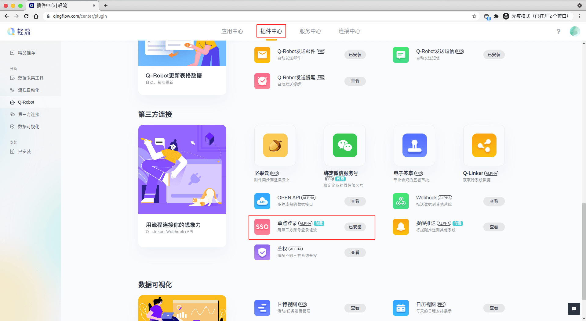
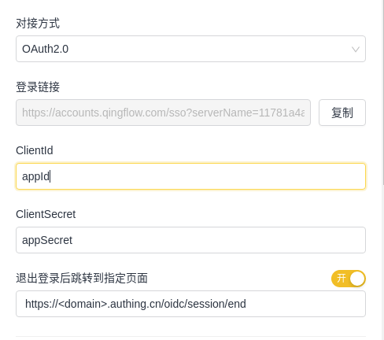
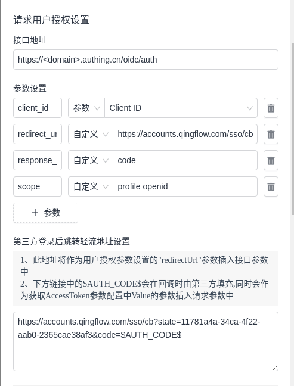
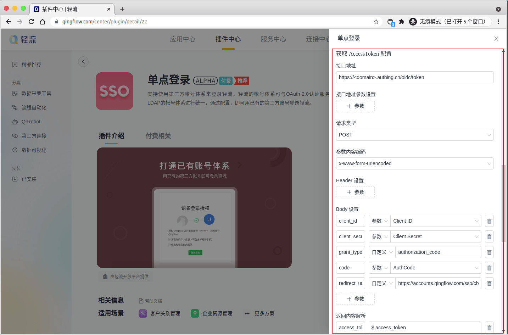
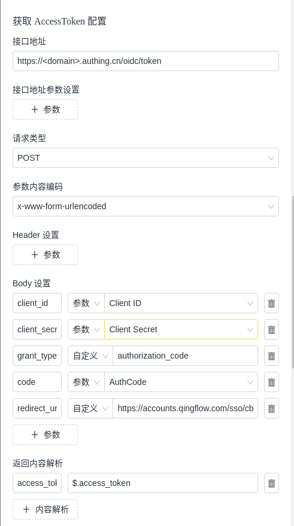

<IntegrationDetailCard title="配置轻流 SSO 登录">

配置轻流 SSO 登录，你需要有管理员权限。进入**轻流轻商城**。

找到**插件中心** -> **单点登录**。

点击**配置**，打开 **全局单点登录**。

配置界面填入对应信息，其中 ClientId 对应为 AppID，ClientSecret 对应为 AppSecret。退出登录后跳转到指定页面输入 `https://<domain>.authing.cn/oidc/session/end`，其中 **domain** 为应用域名内容(将应用配置页面对应的内容粘贴即可)。

接下来填写 **请求用户授权设置**，各项所填如下：

- **接口地址**: `https://<domain>.authing.cn/oidc/auth`(将 {{$localeConfig.brandName}} 应用配置页面对应的内容粘贴即可)
- **参数设置**:
  - **client_id** : 类型为 `参数`， 值为 `Client ID`
  - **redirect_uri** : 类型为 `自定义`，值为 `https://accounts.qingflow.com/sso/cb`
  - **response_type** : 类型为 `自定义`， 值为 `code`
  - **scope** : 类型为 `自定义`， 值为 `profile openid`
- **第三方登录后跳转轻流地址设置** 默认为 **轻流** 自动生成，需要将 `authCode=$AUTH_CODE$` 改成 `code=${AUTH_CODE}`

接下来填写 **获取 AccessToken 配置**， 各项所填如下：

- **接口地址**: `https://<domain>.authing.cn/oidc/token`(将 {{$localeConfig.brandName}} 应用配置页面对应的内容粘贴即可)
- **接口地址参数设置**: 不进行填写
- **请求类型**: 选择 **POST**
- **参数内容编码**: 选择 **x-www-form-urlencoded**
- **Header 设置**: 不进行填写
- **Body 设置**:
  - **client_id** : 类型为 `参数`， 值为 `Client ID`
  - **client_secret** : 类型为 `参数`，值为 `Client Secret`
  - **grant_type** : 类型为 `自定义`， 值为 `authorization_code`
  - **code** : 类型为 `参数`， 值为 `AuthCode`
  - **redirect_uri** : 类型为 `自定义`， 值为 `https://accounts.qingflow.com/sso/cb`
- **返回内容解析**
  - **access_token** : 值为 `$.access_token`

接下来填写 **获取第三方 UserId 配置**， 各项所填如下：

- **接口地址**: `https://<domain>.authing.cn/oidc/me`(将 {{$localeConfig.brandName}} 应用配置页面对应的内容粘贴即可)
- **参数设置**:
  - **access_token** : 类型为 `参数`， 值为 `access_token`
- **请求类型**: 选择 **GET**
- **Header 设置**: `Name` 可为空，类型为 `自定义`， 值为 `$access_token$`
- **返回内容解析**:
  - **UserId** : 值为 `$.sub`
  - **用户名** : 值为 `$.name`
  - **邮箱** : 值为 `$.email`
  - **手机号** : 值为 `$.phone`
  - **头像** : 值为 `$.picture`

点击下方 **保存**，完成配置信息保存。

</IntegrationDetailCard>
