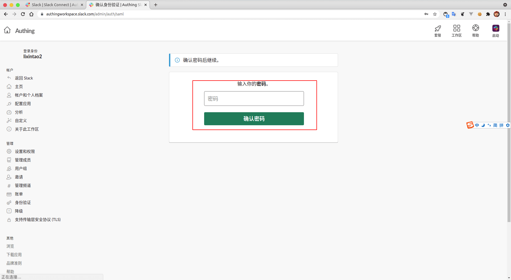
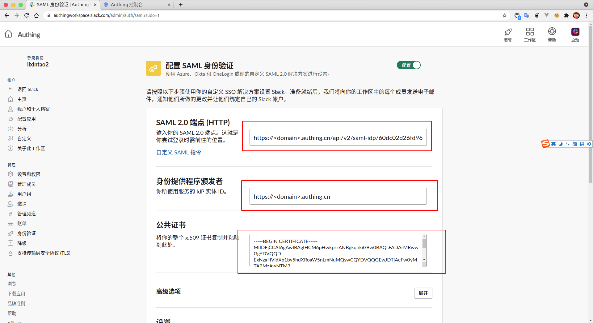
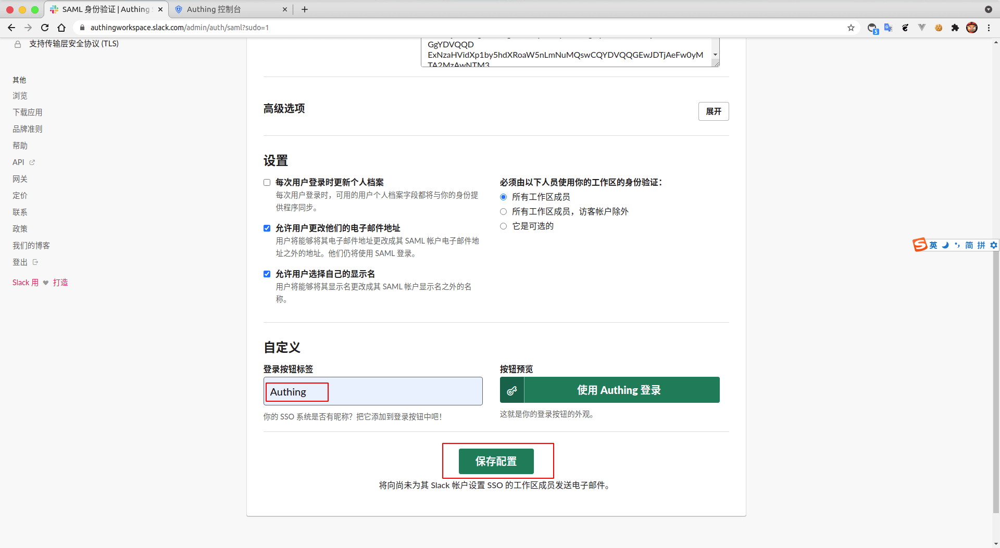
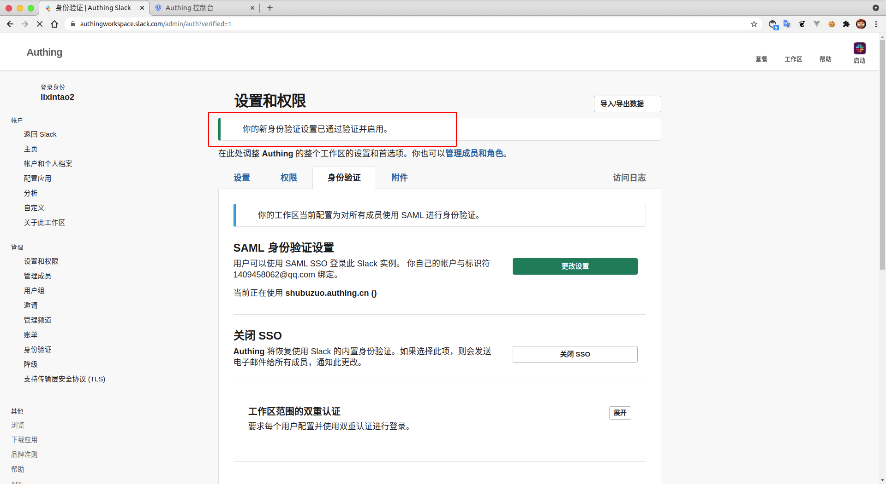

<IntegrationDetailCard title="配置 Slack SSO 登录">

配置 Slack SSO 登录，你需要有管理员权限。进入 **管理控制台**，进入 **设置和管理**，找到 **工作区设置**。

进入 **身份验证**，点击 **配置**。

输入 **当前用户密码**。

填入 {{$localeConfig.brandName}} 中对应的 **SAML 2.0 端点 (HTTP)**、**身份提供程序颁发者**；另外，将下载的 **SAML 验签证书**，复制其内容到 **公共证书**。

填写需要的 **自定义标签**，点击 **保存配置**。

进入 **登录界面**，完成登录。

跳转到 `Slack`，查看相关提示。

根据 **提示**，调整相关选项。

**保存设置**，查看相关提示，显示配置成功。

</IntegrationDetailCard>
