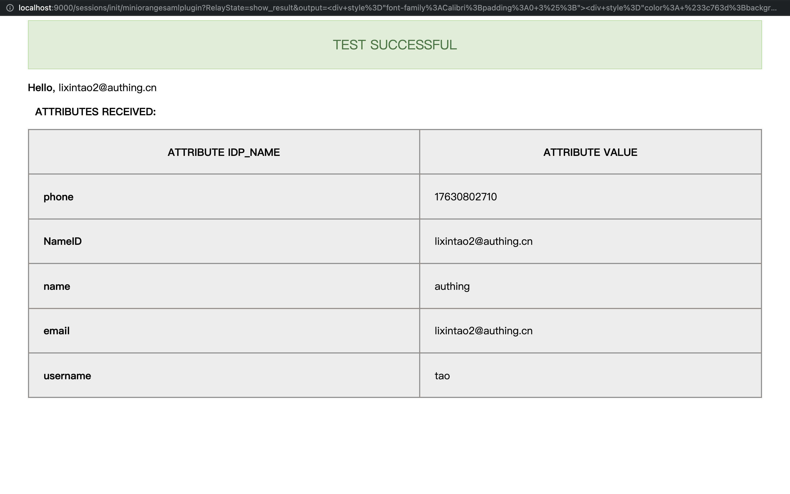

<IntegrationDetailCard title="配置 Sonarqube SSO 登录">

配置 Sonarqube SAML SSO 登录，你需要有管理员权限(并且需要 [安装 miniOrange SAML Support 插件](https://www.miniorange.com/sonarqube-single-sign-on-(sso)#:~:text=SonarQube%20Single%20Sign%20On%20%28SSO%29%20Plugin%20SAML%20Single,securely%20authenticate%20the%20user%20to%20the%20SonarQube%20application.))。点击导航中的 **Administration**，选择 **Configuration**， 点击 **miniOrange SAML Support**。

在 **配置** 中填写你的 **IDP Name**，**IDP Entity ID**， **Login URL**。 其中 **IDP Entity ID**、 **Login URL** 来自 {{$localeConfig.brandName}} 对应的应用，可以 **复制粘贴** 完成填写。

另外，将 **SAML 验签证书** 内容复制到 **X.509 Certificate**。

**属性映射** 可以都填写 `email`。

**保存** 以上填写项，同时 **点击** `Enable SAML Login`，启用 **SAML Login**。

进入 **miniOrange SAML 配置选项页**。

选择 **Test Configuration**。 点击 **Test Configuration**。

进入 {{$localeConfig.brandName}} 登录页面，输入对应的 **账号密码**，完成登录。

登录成功后，配置检测成功。

</IntegrationDetailCard>
