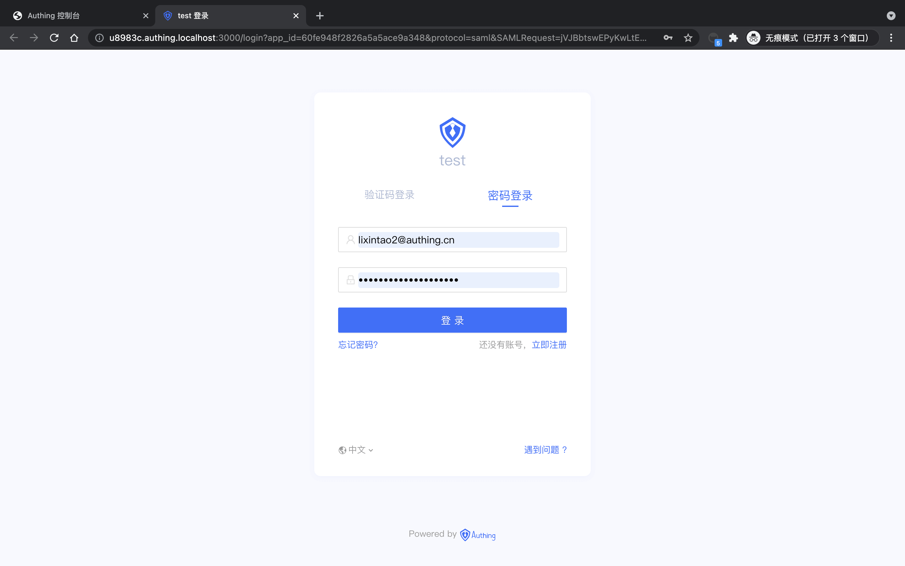
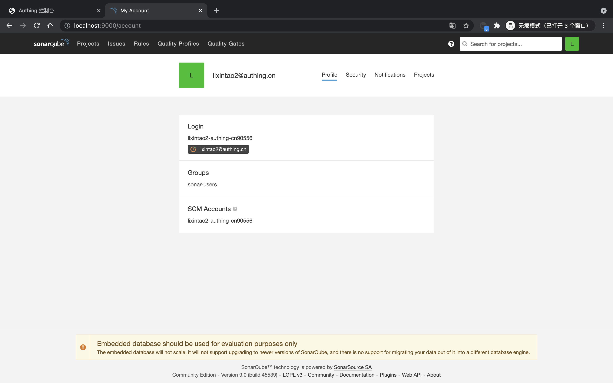

<IntegrationDetailCard title="体验登录">

退出当前用户，进入登录界面，选择 **Login with Authing**(名字可能取决于 SAML 配置的 `IDP Name`)。

进入 {{$localeConfig.brandName}} 登录页面。

在登录界面输入之前创建的用户账号密码，即可成功登录到 **Sonarqube**。

查看 **用户信息**。

</IntegrationDetailCard>
