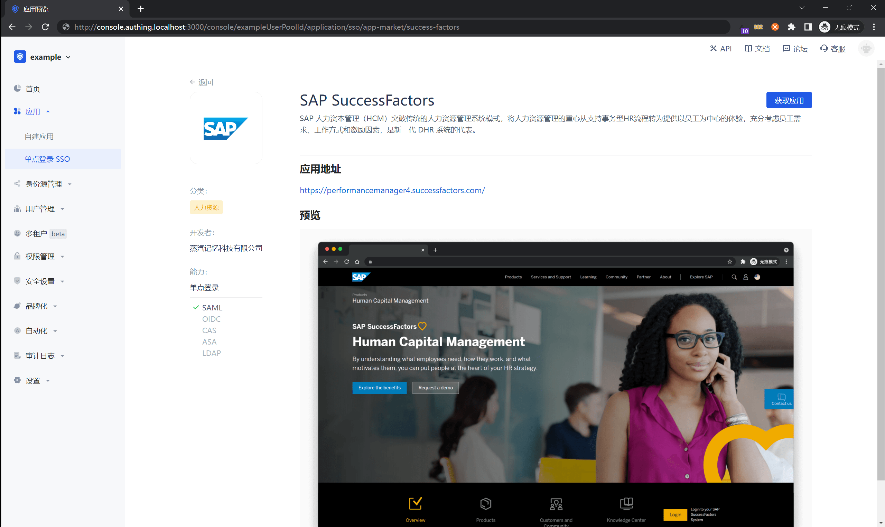
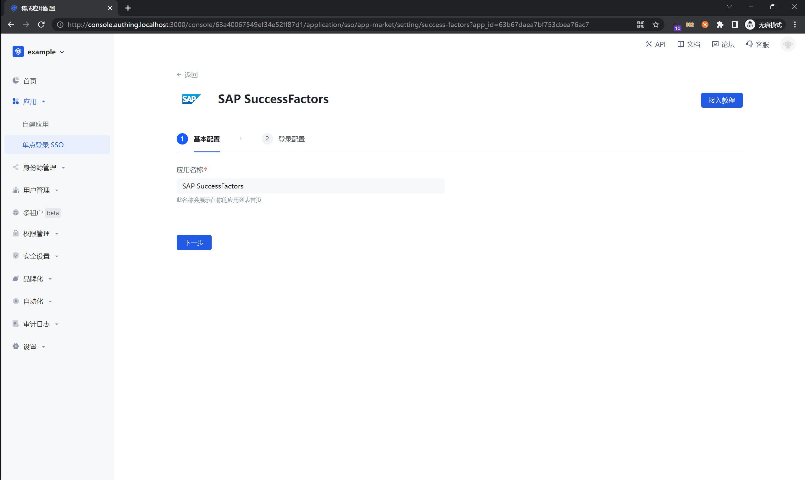
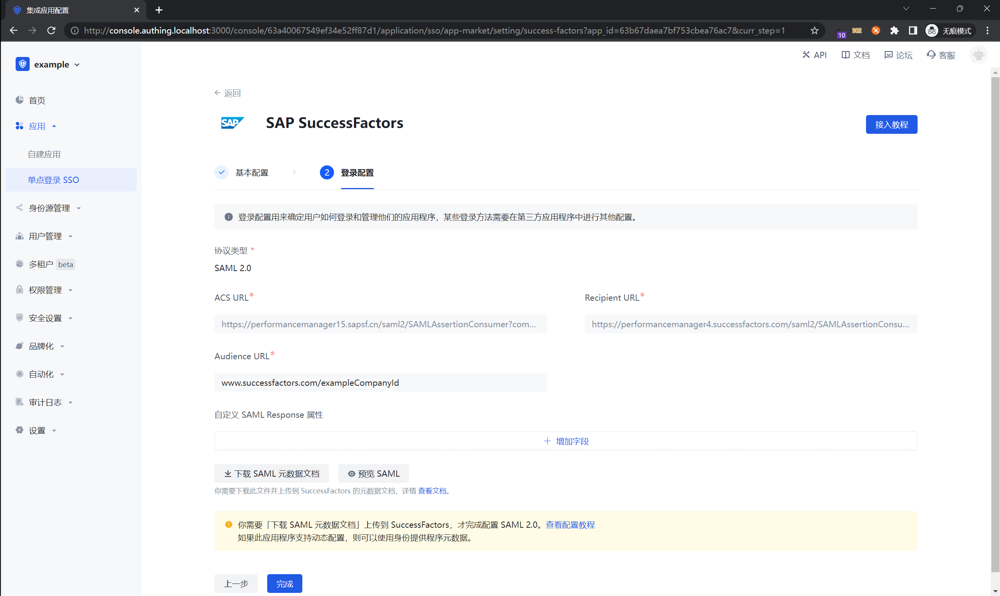
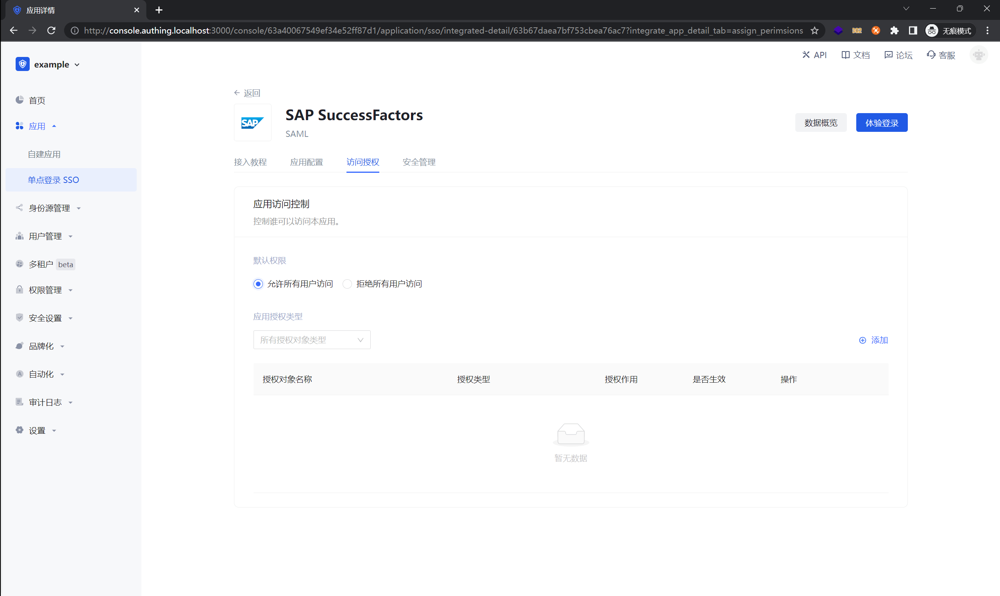

<IntegrationDetailCard :title="`在 ${$localeConfig.brandName} 中创建应用`">

进入[**控制台**](https://console.authing.cn) > **应用市场**，点击 SAP SuccessFactors，点击获取应用。

填写应用名称。点击下一步。

从 SAP SuccessFactors 创建公司后，将你的 Company ID 拼接到示例链接处，并填写入 ACS URL 和 Recipient URL 中：

例如：

你创建的 Company ID 为 exampleCompanyId

ACS URL: https://performancemanager15.sapsf.cn/saml2/SAMLAssertionConsumer?company=exampleCompanyId

Recipient URL: https://performancemanager4.successfactors.com/saml2/SAMLAssertionConsumer?company=exampleCompanyId

点击「完成」，在访问授权页点击「允许所有用户访问」（可以按照实际需求给部分用户授权）

</IntegrationDetailCard>
