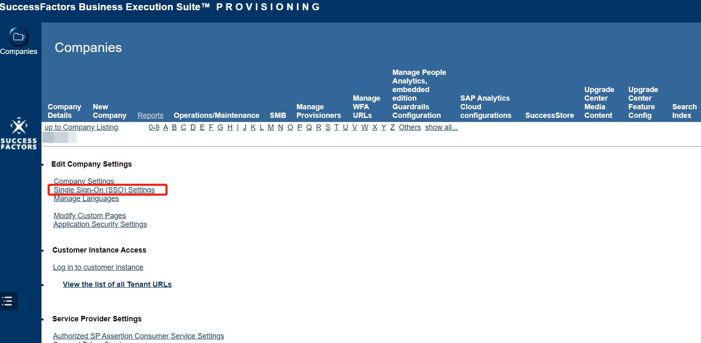
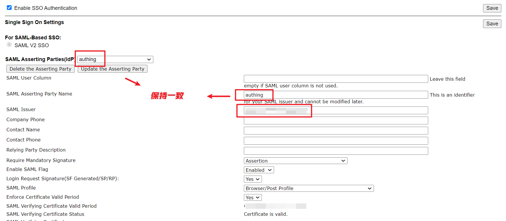
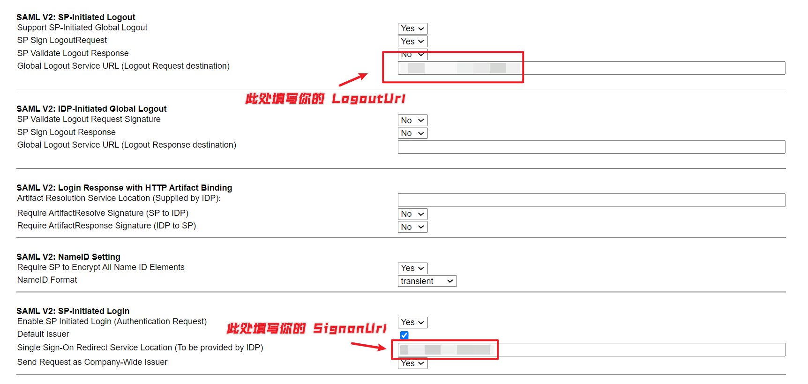
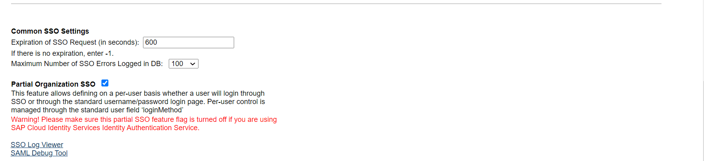

<IntegrationDetailCard title="配置 SuccessFactors SSO">

登入你的 [SAP SuccessFactors 管理面板](https://performancemanager4.successfactors.com/login)，在 **Company Listing** 中选选择你的 Company，点击 「Single Sign-On (SSO) Settings」。

点击「SAML Asserting Parties(IdP)」，选择你为接入 Authing 而创建的 IdP，并与 SAML Asserting Party Name 保持一致。

从 Authing 控制台获取 **IDP Issuer URI** 填入 **SAML Issuer** 中。

之后获取 **LogoutUrl** 填入 **Please enter the redirect URL for a user logout** 及 **Global Logout Service URL (Logout Request destination)** 中，并下载 SAML 元数据文档，粘贴到 **SAML Verifying Certificate** 中。

获取 **SigninUrl** 并填入 **Single Sign-On Redirect Service Location (To be provided by IDP)**。

然后回到顶部点击「Save」保存后在 **Enable SAML Flag** 下拉框中选择 **Enable** 开启 SSO 登录。

</IntegrationDetailCard>
