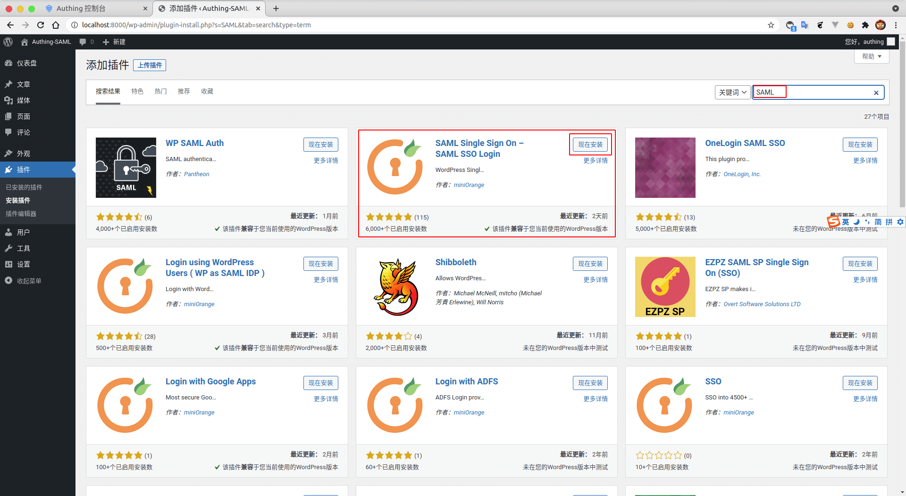
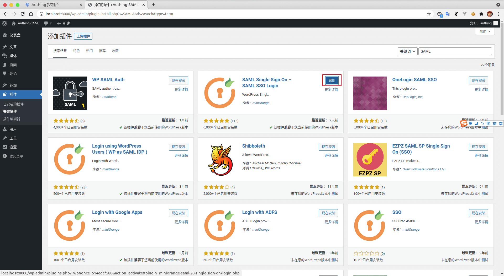
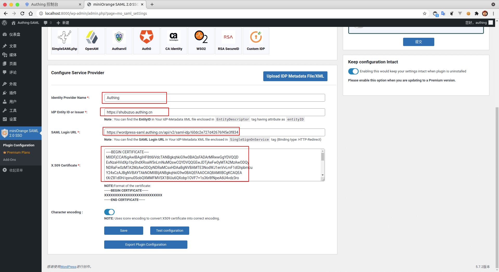
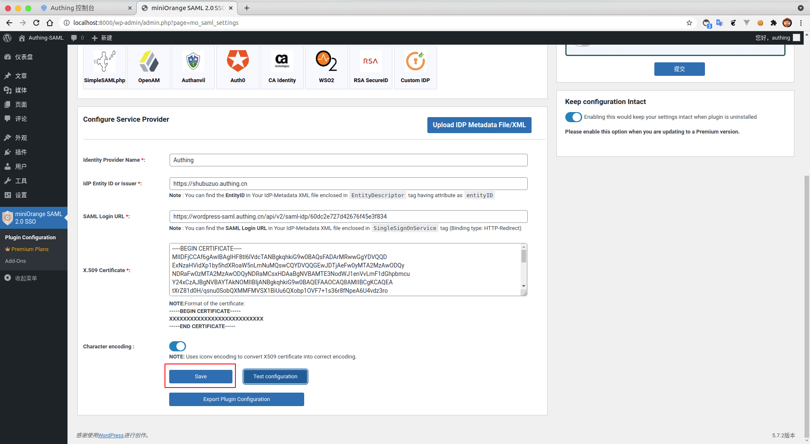
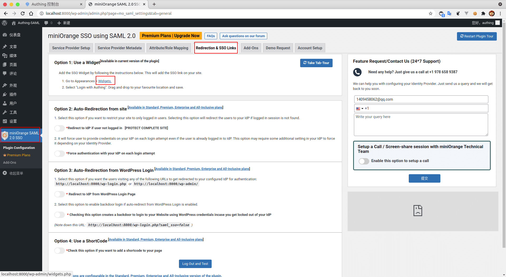
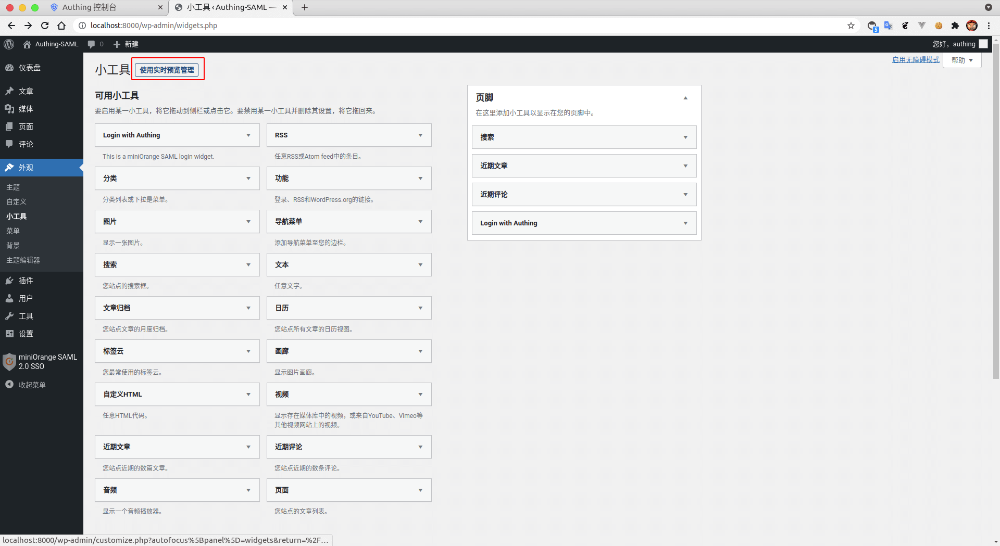
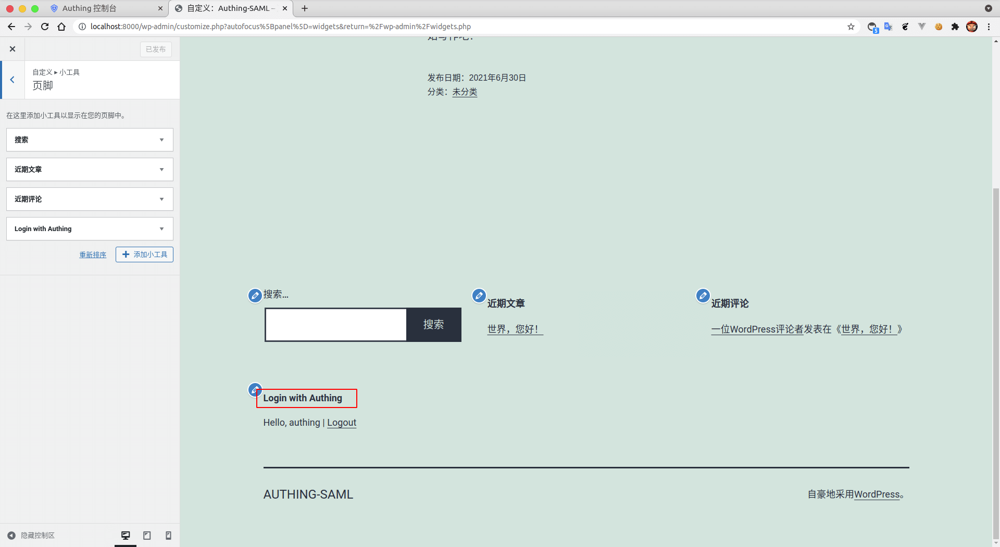

<IntegrationDetailCard title="配置 Wordpress SSO 登录">

配置 Wordpress SSO 登录，你需要有管理员权限。进入 **管理控制台**，进入 **插件**，找到 **安装插件**。

搜索框输入关键字 `SAML`，回车进行搜索， `选择` 如图插件，并进行 **安装**。

**启用** 当前插件。

填入 {{$localeConfig.brandName}} 中对应的 **Identity Provider Name** 、**IdP Entity ID or Issuer**、**SAML Login URL**；另外，将下载的 **SAML 验签证书**，复制其内容到 **X.509 Certificate**。

点击 **Test configuration**，进行配置测试。

弹出 `验证窗口`，填写 `对应账户信息`。

完成 `测试`。

**保存** 配置

**选择** `miniOrange SAML 2.0 SSO`，进入 `Redirection & SSO Link`， **点击** `Widgets`。

**进入** 外观，查看 **Login with Authing**，展开视图组件，将其添加到 **页脚**，完成 `添加`。

使用 **实时预览管理**。

查看对应 `组件`。

</IntegrationDetailCard>
