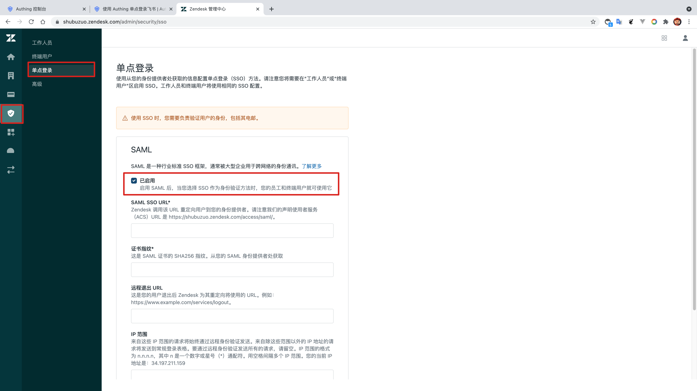
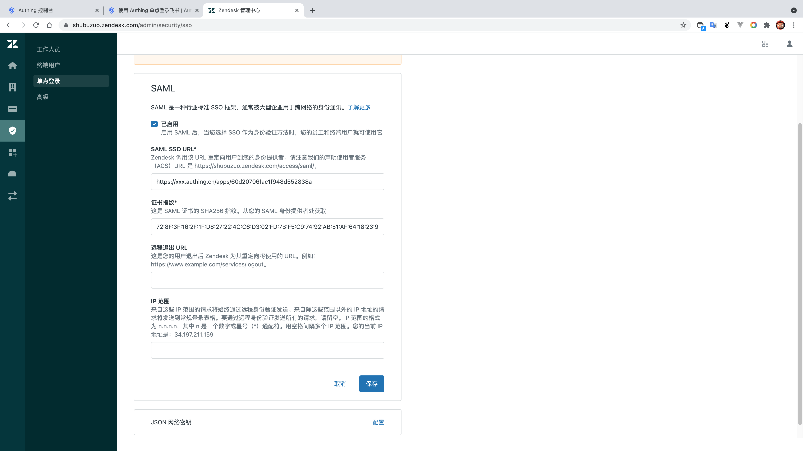
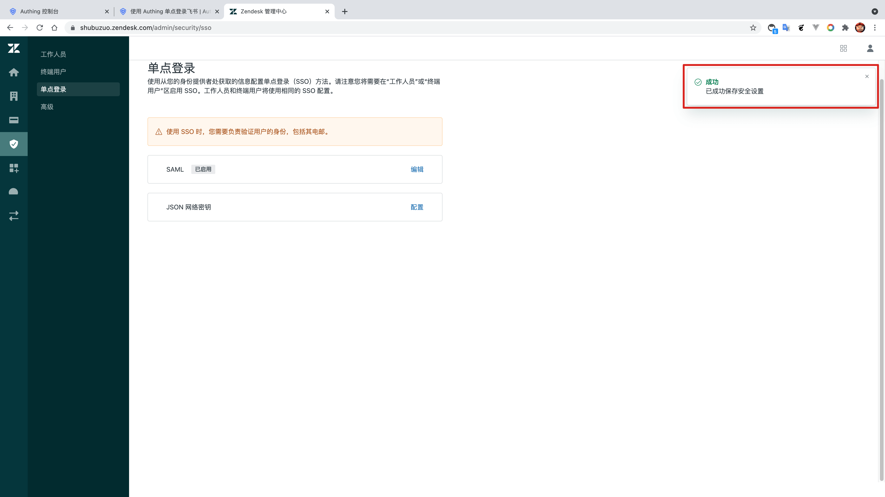
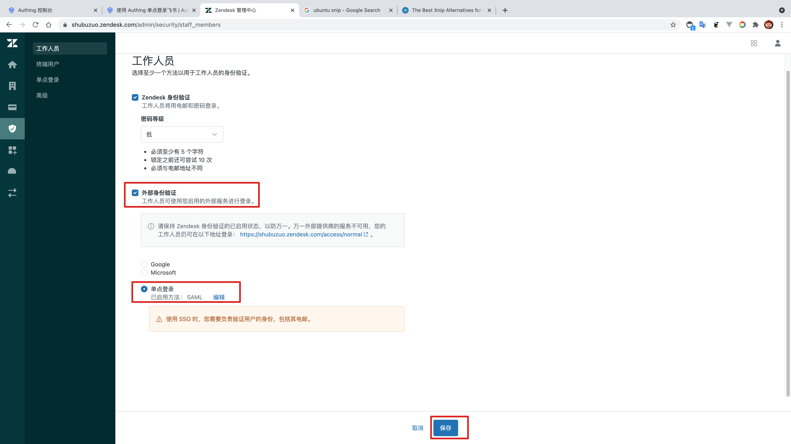

<IntegrationDetailCard title="配置 ZenDesk SSO 登录">

配置 ZenDesk SSO 登录，你需要有管理员权限。进入**管理台**，点击**安全**，找到**单点登录** -> **SAML**，启用 **SAML 单点登录**。

填入 {{$localeConfig.brandName}} 中对应的 **SAML SSO URL**；另外，复制 **证书指纹**，粘贴到 **ZenDesk 的证书指纹**，点击「保存」。

**保存成功**。

进入**管理台**，点击 **安全**，找到 **工作人员** -> **外部身份验证** -> **单点登录**，依次确认选择 **外部身份验证**，**单点登录**。

</IntegrationDetailCard>
